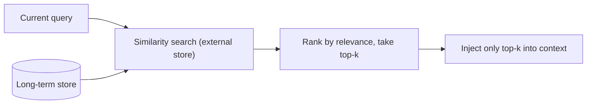

# Memory & state — recall roadmap

## Roadmap: recall across sessions

**What this section covers.** How an agent pulls the *relevant* few items out of a large long-term
store — retrieve-then-inject and relevance ranking — and the frontier problems that appear once
memory must be managed over weeks and many sessions.

**The ideas you'll meet:**

- **Retrieve-then-inject** — keep everything in the store; at the moment of need pull in only the relevant items.
- **Relevance score** — semantic similarity to the current query, optionally combined with recency or importance.
- **Ranking / top-k** — order the hits by score and take only the few that matter.
- **Irrelevant recall harm** — off-topic memories waste tokens and actively distract the model, so recall is a ranking problem, not a retrieval problem.
- **Eviction policy** — the open question of what to forget as memory grows.
- **Context poisoning** — a stale or wrong memory recalled confidently makes the model reason from a falsehood.
- **Memory conflict / consistency** — many sessions writing a shared store disagree, and a later recall surfaces both.
- **Evaluating memory quality** — we can score a retrieval, but not yet whether the memory as a whole is helping.

**Why it matters.** Long-term memory is only useful if recall surfaces what *matters* for this
query and leaves the rest in the store; at scale, deciding what to keep, forget, and trust becomes
the hard, still-open part.
