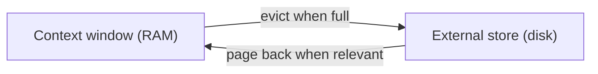

## The memory hierarchy, and how memory differs from RAG

**In brief.** The canon's contribution is to stop treating the context window as a size problem and
start treating it as one tier of a memory hierarchy the agent manages itself — and then to notice that
the store on the other tier is one the agent wrote.

**Virtual context management.**

- **The reframing** — MemGPT, and its productionized successor Letta, treat the finite context window
  like RAM and an external store like disk, and **page** memory between them. The window is one tier of
  a hierarchy the agent manages, not the whole of memory.
- **The move when the window fills** — evict older content to the external store, and page it back in
  when it becomes relevant again. Eviction is not permanent deletion: what leaves the window is still
  in the store, and anything evicted may well be useful later.
- **Why a bigger window is not the frontier answer** — a larger window raises the ceiling but is still
  finite, so it still fills; the overflow is deferred, not removed. In-context capacity is never free
  either: every item competes for the same space, and carrying content the current step does not need
  spends tokens — and the cost of a long context — on nothing. Paging, not size, is the durable answer.
- **The ancestry** — this is the direct ancestor of the buffer-plus-external-store split this topic
  teaches, and the reason memory and context engineering are the same problem viewed from different
  angles: deciding what occupies the finite window at each step, over time.

**Agent memory versus document RAG.**

- **The shared mechanism** — both retrieve-then-inject from a vector store: text is embedded, ranked by
  semantic similarity to the current query, and only the top-k enters context. On mechanism alone they
  look identical.
- **The difference is who wrote the store** — classic RAG reads a curated knowledge corpus the agent
  did not author and that is mostly static. An agent's long-term memory reads back a store the agent
  **itself wrote** across prior sessions: its own facts, preferences, and past conclusions.
- **What that difference costs** — because the store is self-authored and evolving, write policy,
  **staleness**, and **forgetting** become first-class concerns. What you stored may no longer be true
  when you read it back; a once-true fact recalled after it changed poisons the context and the model
  reasons from a falsehood; and deciding what to evict as the store grows has no settled rule. These are
  central to memory and marginal to classic RAG.

**Why it matters.** Knowing that the window is a tier you page rather than a number you raise, and that
your memory store is your agent's own evolving writing rather than a curated corpus, is what turns "we
use a vector DB" into a memory design you can defend.
