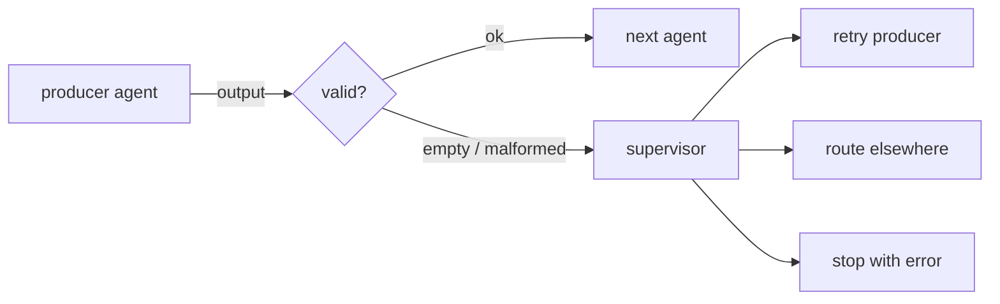

# Multi-agent orchestration — handoffs

## Validate every handoff

A **handoff** is the moment one agent's output becomes the next agent's input. It is the single most
dangerous seam in a multi-agent system, because a bad output that crosses it unchecked corrupts
everything downstream — and usually *silently*, with no exception to point you at the problem. The rule
is simple: **validate every handoff before the next agent consumes it.**

Validation here is not deep semantic checking; it is a guard at the boundary. Reject the obviously
broken cases — a `None`, an empty string, an empty dict or list — with a structured rejection the
supervisor can act on, rather than passing the empty value along or crashing the run.

```python
def validate_handoff(output):
    if output in (None, "", {}, []):
        return {"ok": False, "error": "empty_handoff"}
    return {"ok": True, "value": output}
```



When a handoff is rejected, the supervisor is finished making progress on that path — it can retry the
producing agent, route elsewhere, or stop with a clear error. What it must **not** do is let an empty
or malformed output flow on as if it were real. A validated handoff turns a silent, far-away corruption
into a loud failure right at the seam where it happened. This is the same untrusting-boundary discipline
that guards a single agent's tool calls and its budget — see
[agent-guardrails-budgets](../agent-guardrails-budgets/).
