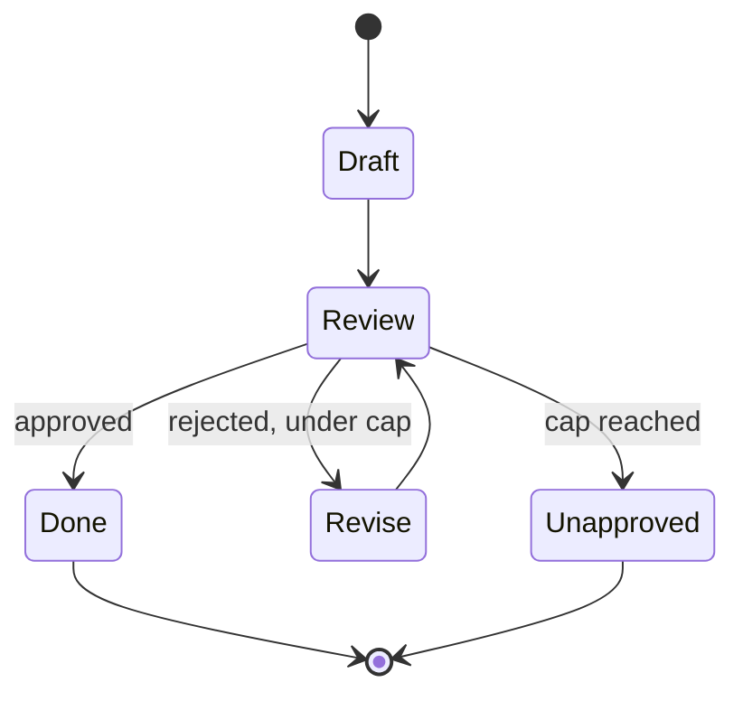

# Multi-agent orchestration — failure-modes roadmap

## Roadmap: Failure modes and scale

**What this section covers.** The ways multi-agent systems fail that single agents don't — silent bad
outputs and approval loops with no exit — the defenses for each, and the open problems that appear once
a system grows to dozens of agents.

**The ideas you'll meet:**

- **Silent bad output** — a plausible-but-wrong result passed on unchecked; every agent reports success while the system as a whole is wrong.
- **Critic** — an agent whose one job is to review another agent's output and reject it when it is bad, before it flows on.
- **Approval loop** — writer drafts, critic reviews, writer revises; with no exit it can run forever, burning tokens and money.
- **Bounded exit (`max_tries`)** — the cap that stops the loop and returns the best draft so far, marked unapproved — a terminating loop beats an infinite one.
- **Compounding errors at scale** — mostly-right handoffs whose small errors accumulate silently across a large agent graph until the end state has drifted.
- **Cost explosion** — every added agent multiplies token cost, and the spend climbs faster than the capability.
- **Emergent failures** — failures that arise from agents interacting — deadlocks, oscillating loops, amplified mistakes — and resist attribution.

**Why it matters.** These are the quiet ways a multi-agent system falls apart, and neither a bigger
model nor more agents closes the gaps — a supervisor, validation, and bounded loops are the ground you
stand on, and naming the frontier problems honestly is what reads as senior.
