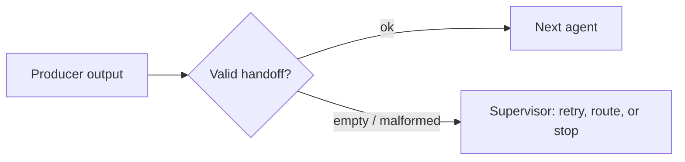

# Multi-agent orchestration — handoffs roadmap

## Roadmap: Validating handoffs

**What this section covers.** The single most dangerous seam in a multi-agent system — the **handoff**,
where one agent's output becomes the next agent's input — and the discipline that keeps it safe:
validate every handoff at the boundary before the next agent consumes it.

**The ideas you'll meet:**

- **Handoff** — the moment one agent's output becomes the next agent's input; the seam where multi-agent failure concentrates.
- **Validate every handoff** — guard the boundary before the next agent consumes the output, rather than trusting it or checking only at the end.
- **Boundary guard** — a cheap check that rejects the obviously broken cases (`None`, empty string, empty dict or list) — not deep semantic verification.
- **Structured rejection** — return a structured error (e.g. `{"ok": False, "error": "empty_handoff"}`) the supervisor can act on, instead of passing the empty value along or crashing.
- **Silent corruption** — an unchecked bad output that flows downstream with no exception to point at the problem, corrupting everything after it.

**Why it matters.** A validated handoff turns a silent, far-away corruption into a loud failure right
at the seam where it happened — the same untrusting-boundary discipline that guards a single agent's
tool calls.
