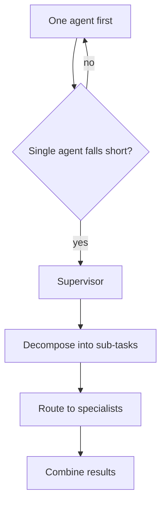

# Multi-agent orchestration — supervisor roadmap

## Roadmap: When multi-agent helps and the supervisor pattern

**What this section covers.** When a team of agents is actually worth its cost, and the workhorse
design once you've earned one — the **supervisor pattern**, where a coordinating agent decomposes a
task, routes each piece to a narrow specialist, and combines the results.

**The ideas you'll meet:**

- **Single agent first** — the default answer to "should this be multiple agents?" is *not yet*; add agents only when one demonstrably can't do the job.
- **Coordination cost** — every added agent is another prompt to maintain, more latency, more tokens, and a new handoff that can go wrong.
- **Supervisor** — the one coordinating agent that decomposes the task, routes sub-tasks to specialists, and combines their outputs into the answer.
- **Specialist** — a narrow agent with a focused prompt and a small tool set, which makes it more reliable and far easier to evaluate than a do-everything agent.
- **Bounded revision loop** — the supervisor's writer/critic cycle with a hard revision cap, so a never-satisfied critic can't spin forever.

**Why it matters.** Multi-agent buys specialization and independent review but costs latency, money,
and new failure modes — so knowing *when* to split and centralizing coordination in one supervisor is
what keeps a team observable and debuggable instead of a pile of loosely-wired agents.
