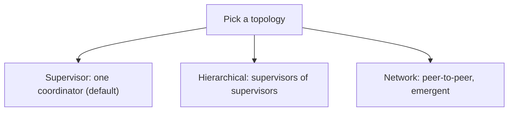

# Multi-agent orchestration — topologies roadmap

## Roadmap: Multi-agent topologies and frameworks

**What this section covers.** Once you've earned a team, *how the agents are wired* — the **topology**.
A small vocabulary (supervisor, hierarchical, network) decides how observable and how bounded the
system is, and the frameworks you'll meet are just different ways to spell those topologies.

**The ideas you'll meet:**

- **Topology** — how the agents are wired together; the choice that decides how observable and boundable the system is.
- **Supervisor topology** — one coordinator decomposes and routes while specialists report back to it; centralized and debuggable — the sensible default.
- **Hierarchical** — supervisors of supervisors: nest the pattern so it scales to bigger tasks while every seam stays a clear parent-to-child handoff.
- **Network (peer-to-peer)** — agents talk directly with no coordinator; the most flexible topology and the hardest to trace, bound, and control.
- **Emergent failures** — failures that come from agents *interacting* rather than from any single agent.
- **Most-constrained topology** — the durable rule: prefer the tightest wiring that solves the problem, because constraint buys observability and bounded failure.
- **Frameworks (LangGraph / CrewAI / AutoGen)** — tools that each encode these topologies directly, so you choose the topology first and let the framework express it.

**Why it matters.** Picking the right topology is most of the battle: the more constrained the wiring,
the more observable and bounded your failures, which is why a network is a last resort and the
framework is a detail underneath the topology.
