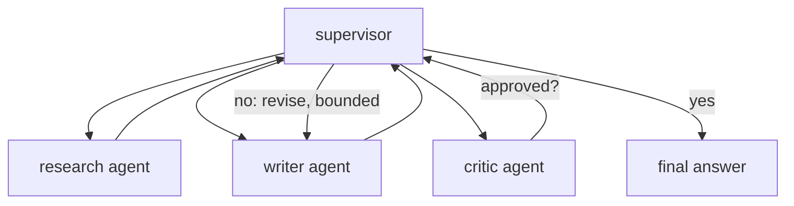

# Multi-agent orchestration — the supervisor pattern

## The supervisor pattern

When you do need a team, the workhorse design is the **supervisor pattern**. One coordinating agent —
the **supervisor** — owns the task. It decomposes the task into sub-tasks, routes each sub-task to the
**specialist** best suited to it, and combines the specialists' results into the final answer. The
supervisor orchestrates; it does not do every step itself.

Crucially, the specialists report back **to the supervisor**, not to each other. Funneling
coordination through one agent is what makes the flow observable and debuggable: there is a single
place that decides what runs next and assembles the result.

```python
def supervise(research_agent, writer_agent, critic_agent, task, max_revisions=3):
    research = research_agent(task)              # delegate to a specialist
    content = writer_agent(research, None)       # delegate to another
    for _ in range(max_revisions):               # bounded review loop
        review = critic_agent(content)
        if review["approved"]:
            return content
        content = writer_agent(research, review["issues"])
    return content                               # give up gracefully after the cap
```



That is the whole shape: a coordinator, a few specialists, and a **bounded** loop. The revision cap is
not optional — it is what stops a never-satisfied critic from spinning forever (the failure mode a
later lesson drills).

## Specialists do one thing well

A specialist earns its keep by being **narrow**. A researcher searches and summarizes; a writer drafts;
a critic reviews. Each has a tight prompt and a small tool set, and that focus is exactly why it is more
reliable and far easier to **evaluate** than one do-everything agent. You can test the critic in
isolation with a bad draft and check it flags the right issues.

Contrast that with a single agent asked to research *and* write *and* self-review in one prompt: its
context is crowded, its behavior is harder to pin down, and when it goes wrong you can't tell which of
its three jobs failed. Splitting into specialists trades one fuzzy agent for several sharp, testable
ones — coordinated by the supervisor.

The seam between specialists is where the risk lives. Each time the supervisor passes one specialist's
output to the next, that handoff must be checked before it is trusted — the subject of the next
section — and each specialist should be graded against the same discipline as any component; see
[eval-methodology](../eval-methodology/).
