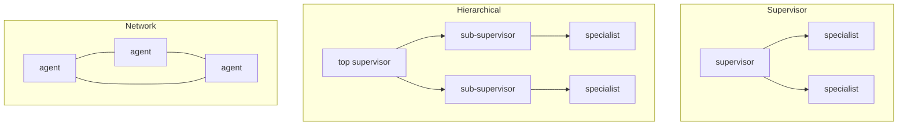

# Multi-agent orchestration — topologies

## Choosing a topology

Once you've earned a team of agents, the next decision is *how they are wired* — the **topology**. There
is a small vocabulary here, and picking the right one is most of the battle, because the topology decides
how observable and how bounded your system is.

- **Supervisor (single coordinator).** One agent decomposes the task, routes sub-tasks to specialists, and
  combines the results; specialists report back to it. Coordination is centralized, so the flow is
  observable and easy to debug. This is the sensible **default**.
- **Hierarchical (supervisors of supervisors).** When one supervisor coordinating a flat list of
  specialists gets too big, nest the idea: a top-level supervisor coordinates mid-level supervisors that
  each own a cluster of specialists. It scales the supervisor pattern to larger tasks while every seam
  stays a clear parent→child **handoff**.
- **Network (peer-to-peer).** Agents talk directly to one another with no single coordinator. It is the
  most flexible topology and the hardest to trace, bound, and control: interactions are **emergent**, and
  some failures come from the interaction itself rather than any single agent.



```python
# Supervisor (default): centralized, debuggable.
result = supervisor.run(task, specialists=[researcher, writer, critic])
```

The durable rule is to prefer the **most constrained** topology that solves the problem — usually
supervisor or hierarchical. Constraint is what buys you observability and bounded failure, so you reach
for a network only when a strict hierarchy genuinely can't express the collaboration.

## Frameworks encode these

The multi-agent frameworks you'll meet each encode these topologies directly, and knowing which is which
reads as senior.

- **LangGraph** models agents as **nodes in an explicit graph** with typed edges. Making the topology
  explicit is exactly what lets you reason about, validate, and bound each handoff instead of hoping.
- **CrewAI** frames a "crew" of **role-specialized** agents with a coordinator — the same
  specialists-do-one-thing-well idea, named as roles.
- **AutoGen** supports both **supervised and conversational** (network-ish) arrangements, so the same tool
  can express either a tight hierarchy or a looser peer conversation.

The takeaway underneath the frameworks is the one that outlives any of them: the framework is just how you
*spell* a topology, so choose the topology first — the most constrained one that works — and let the tool
express it. Grade whichever arrangement you pick with the same rigor as any component; see
[eval-methodology](../eval-methodology/).
