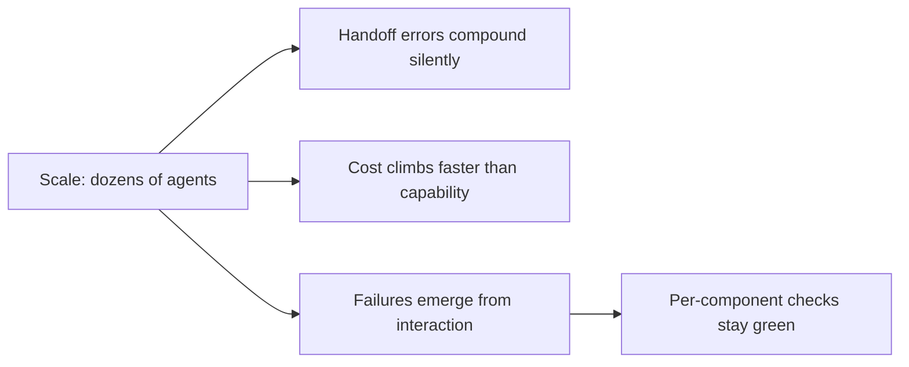

## Multi-agent at scale: the open problems

**In brief.** The supervisor, validated handoffs, critics, and bounded loops are the solid ground. Once
a system grows to dozens of agents, a set of unsolved problems appears that none of them close — and
that more agents make worse, not better.

**The frontier problems.**

- **Reliable handoffs at scale** — a guard catches an empty or malformed output, but across a large agent graph the errors that slip through are each mostly right. By the tenth handoff the end state has drifted, with no single call to blame. Keeping handoffs reliable as the graph grows is an open problem, not a solved one.
- **Cost explosion** — every added agent multiplies token cost: more prompts, more turns, more review loops. The spend climbs faster than the capability, so a system that scales to many agents can spend far more than the work is worth.
- **Emergent failures** — failures that come from agents interacting rather than from any one agent: two critics that deadlock, a revision loop that oscillates, agents that amplify each other's mistakes. They appear only at scale and resist attribution, which is what makes them hard.
- **Evaluation at scale** — per-agent evals and per-handoff validators are per-component checks, and interaction-level failures are precisely what per-component checks miss. Passing every one of them therefore does not certify the system end-to-end, and attributing an end-to-end failure across a large graph is unsolved.
- **The honest read** — a supervisor and validation help but do not close these gaps. This is not a latency problem: a larger or faster model does not automatically make a big multi-agent system correct or cheap, and neither does adding more agents. Naming which gap to invest in first, without claiming any of them is solved, is what reads as senior.

**Why it matters.** These are the problems that decide whether a large agent graph is worth building at
all, and the answer to each is structure and honest measurement — never a bigger model or another agent.
