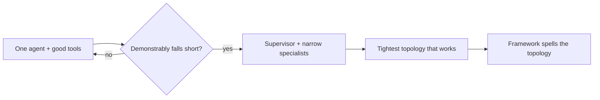

## Earning a team: the most constrained design that works

**In brief.** One rule governs every multi-agent decision: prefer the most constrained design that
solves the problem. Start with one agent, split only on evidence, keep whatever you add narrow, and
pick the tightest wiring — the framework is only how you spell it.

**The rule and its parts.**

- **Single agent first, rigorously** — not a ban on multi-agent and not a fixed head-count, but a bias against unearned coordination cost, latency, tokens, and handoff failure modes. A single agent with a sharp prompt and the right tools handles most tasks and usually has headroom left before splitting is justified.
- **What "demonstrably can't do the job" looks like** — the evidence that earns a team: the task needs genuinely different skills or tool sets that don't fit one focused prompt; one agent's context gets so crowded it loses the thread; or one agent's work must be independently reviewed by another. "It feels more sophisticated" and "it would look more robust" are not evidence.
- **What splitting costs** — every added agent is another prompt to maintain, more latency, more tokens, and a new seam where a bad output can slip through. A six-agent pipeline has six prompts to keep correct and five handoffs that can each silently pass along garbage.
- **A specialist is defined by being narrow** — a tight prompt and a small tool set scoped to its one job: a researcher searches and summarizes, a writer drafts, a critic reviews. Fewer tools means fewer wrong choices, and that focus is exactly what makes a specialist more reliable than a do-everything agent.
- **Narrow is what makes it testable** — a small, well-defined interface can be exercised in isolation: hand the critic a known-bad draft and assert it flags the right issues. Inside one agent that researches and writes and self-reviews, that same behavior is entangled with the other two jobs, so when it fails you cannot tell which job broke.
- **Three jobs in one agent rebuilds what you were avoiding** — research plus write plus review in a single prompt is the do-everything agent again: crowded context, behavior that is hard to pin down, and nothing separately evaluable.
- **Constraint applies to the wiring too** — prefer the tightest topology that solves the problem, usually supervisor or hierarchical, because constraint is what buys observability and bounded failure.
- **Frameworks only spell topologies** — `LangGraph` models agents as nodes in an explicit graph with typed edges, and making the topology explicit is what lets you reason about, validate, and bound each handoff. `CrewAI` frames a "crew" of role-specialized agents with a coordinator. `AutoGen` supports both supervised and conversational arrangements. Choose the topology first and let the tool express it.

**Why it matters.** Every unearned agent buys coordination cost and a new failure seam while buying no
capability, so the senior move is to defend one agent with good tools, split only on named evidence,
and — when you do split — keep each specialist narrow enough to test on its own.
