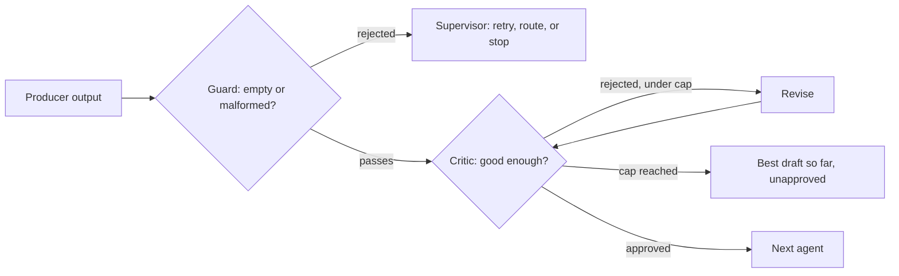

## Layers of defense: guard, critic, and cap

**In brief.** Multi-agent reliability is layered, not single-shot: a cheap structural guard at every
seam, an independent critic on content quality, and a hard cap on any loop driven by another agent's
judgment. Each layer catches exactly what the others cannot.

**The three layers.**

- **The boundary guard — cheap, structural, at every seam** — it rejects the obviously broken cases (`None`, empty string, empty dict or list) with a structured error the supervisor can act on. It is not deep semantic checking, so it says nothing about whether a non-empty output is actually right.
- **The critic — semantic, on content** — a separate agent whose one job is to review another agent's output and approve it or reject it with concrete issues, before it flows on. It judges quality on output the guard already let through.
- **Neither replaces the other** — they operate at different layers, so a system with a critic still needs handoff validation for the structurally broken cases, and a system with handoff validation still needs a critic for the plausible-but-wrong ones. Keeping both is what gives full coverage.
- **Why the reviewer is a separate agent** — independent review is one of the legitimate reasons to split at all. An agent asked to write and review in one prompt has a crowded context and entangled behavior; a reviewer with its own prompt reads the draft from the outside, and that separation is also what makes the check independently testable.
- **Validate at every seam, not only at the end** — checking only the final output lets a silent bad output propagate through several agents first, and leaves you unable to say which seam produced it. Guarding each handoff turns a diffuse, far-away failure into a loud, localized one at its source.
- **Cap any judgment-driven loop** — the `max_tries` rule on a writer/critic cycle is a special case of a broader discipline: any loop whose continuation depends on another agent's judgment can fail to terminate, so it must be bounded and budgeted, exactly as a single agent's tool-call loop is capped and budgeted. The cap is a correctness and cost guarantee, not a latency tweak, and hitting it means returning the best draft so far marked unapproved.

**Why it matters.** Structural guards, semantic review, and bounded loops defend against different
failures, so treating any one of them as a substitute for the others leaves a hole — and the loop cap
is the layer that stops a never-satisfied critic from turning quality into unbounded spend.
