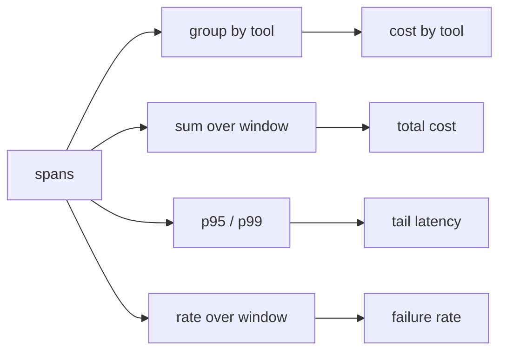

# Observability & tracing — reading the metrics

## Reading the metrics

Recording a span per step gives you the raw material; the skill is turning thousands of spans into the
few numbers you actually watch. Every production metric in this topic — **cost**, **latency**, failure
rate — is an *aggregation over span attributes*. You do not instrument them separately; you record the
right fields per span and roll them up.

Two roll-ups do most of the work. The first is **slicing**: because each span carries its model and
tool, you can group cost by tool and by model instead of staring at one total. When the weekly bill jumps
40%, a run-level total only tells you *that* spend grew; grouping cost by tool shows the summarization
step's tokens doubled — a specific, fixable step instead of a vague number.

```python
from collections import defaultdict

def cost_by_tool(spans):
    totals = defaultdict(float)
    for s in spans:
        totals[s["tool"] or "model"] += s["cost"]
    return dict(totals)
```

The second roll-up is choosing the right **aggregate**. For cost, a sum over a window is what you want.
For latency, the sum or the mean lies to you: a mean can stay flat while the **tail** balloons, because a
few very slow requests are hidden by many fast ones. Users feel the tail — the p95 and p99 — not the
average, so latency is watched as a percentile, not a mean.



The reason this matters is that the metric you compute decides what you can see. A mean latency hides the
run that hangs; a per-tool cost slice finds the step that got expensive; a failure rate over a window
surfaces the one-in-a-thousand error that no single run reveals. Pick the aggregate that exposes the
tail and the outlier, not the one that averages them away — that is what turns spans into an answer.
