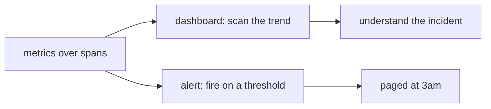

# Observability & tracing — alerts and dashboards roadmap

## Roadmap: alerts and dashboards

**What this section covers.** The two ways you *act* on the metrics once you are recording them: a
dashboard you watch for trends, and an alert that watches thresholds for you and pages you when a budget
is breached.

**The ideas you'll meet:**

- **Dashboard** — the always-on view of the aggregates (cost per hour, p95 latency, failure rate) that makes a trend legible at a glance.
- **Alert** — a rule on a metric that fires when a threshold is crossed, so you do not have to be staring at the dashboard.
- **Threshold / budget** — the ceiling you set (cost per run, latency SLO, failure-rate limit) that defines when an alert triggers.
- **Dashboards for trends, alerts for thresholds** — the rule of thumb for which tool does which job.

**Why it matters.** A trace nobody looks at catches nothing; the dashboard and the alert are what close
the loop from *observing* a production surprise to *being told* the next time it happens.
