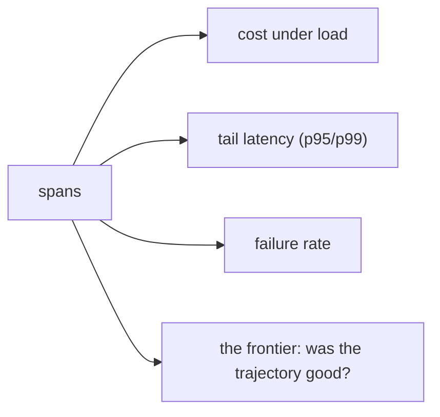

# Observability & tracing — production metrics roadmap

## Roadmap: production metrics

**What this section covers.** The metrics that dev testing systematically under-samples — cost, latency,
and failure rate under real load — why each is "fine on average, bad at scale," and how to roll thousands
of spans up into the few numbers you actually watch.

**The ideas you'll meet:**

- **Cost under load** — per-run cost multiplied by real volume, plus longer tool loops on messy inputs, turning a rounding error into a surprising bill.
- **Tail latency** — the p95 and p99 that users actually feel, far worse than the median dev testing sees.
- **Failure rate** — the one-in-a-thousand tool failure that is invisible until you run enough volume to hit it.
- **Aggregation** — every metric is a roll-up over span attributes; you record the right fields, then sum, slice, or take a percentile.
- **Slicing** — grouping cost by tool and model to find the specific step that got expensive instead of staring at one total.
- **Trajectory evaluation** — the frontier question of whether a whole multi-step run was any *good*, where failures are silent and semantic.

**Why it matters.** These are the surprises that turn a demo into an incident, and the only way to catch
them is to record every span and watch the aggregate and the tail — not to re-run the happy path.
