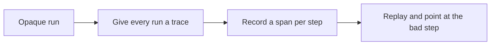

# Observability & tracing — tracing and spans roadmap

## Roadmap: tracing and spans

**What this section covers.** How you stop guessing about a production agent by recording what it did:
the *trace* of a whole run, the *span* per step that carries the fields you will later sort and add up,
and how this is the same distributed-tracing canon everything else already uses.

**The ideas you'll meet:**

- **Trace** — the complete record of one agent run, made of its ordered steps and carrying totals like cost and latency.
- **trace_id** — the id on a run that ties a user complaint back to the exact sequence of steps.
- **Span** — a record of one step: the tokens, cost, latency, tool, and error for that step.
- **Per-step latency** — recording latency on each span, not just the run, so a single slow step is visible instead of hidden in the total.
- **OpenTelemetry (OTel)** — the open standard whose trace/span data model agent tracing adopts wholesale.
- **Distributed tracing** — the older lineage (Dapper, Zipkin, Jaeger) of following one request as it fans out; an agent's tool calls are that same fan-out.

**Why it matters.** Everything downstream — the metrics you watch and the alerts you set — is an
aggregation over spans, so a run you cannot see inside is a production incident you can only guess about.
