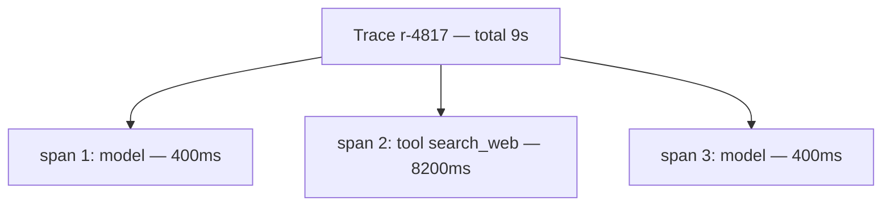

# Observability & tracing — a span per step

## A span per step

A trace is only as useful as the detail inside it. The unit of that detail is the **span**: a record of
one step of the agent's work. Every time the agent calls the model or runs a tool, you open a span,
record what that step did, and close it. A trace is the ordered list of its spans.

What belongs on a span is exactly the set of things you will later want to sort and add up: the tokens
the step used, the **cost** of those tokens, the **latency** in milliseconds, which tool ran (if any),
and whether the step raised an error. Capture those five and almost every production question — *what
was slow, what was expensive, what failed* — becomes a query over spans instead of a guess.

```python
from dataclasses import dataclass

@dataclass
class Span:
    step: int
    tokens: int
    cost: float
    latency_ms: float
    tool: str | None = None
    error: str | None = None
```

The reason to record **latency** per span, not just for the run as a whole, is that a single slow step
is invisible in a run-level number. A run that takes 9 seconds looks fine next to a 10-second budget —
until you see one span inside it spent 8 of those seconds in a single tool call. Per-step latency is
what lets you find *which* step is the problem; the run total only tells you *that* there is one.



The same is true of cost and errors. A span that records `tool="search_web"` and `latency_ms=8200`
tells you the tool to fix; a span with `error="timeout"` tells you the step that failed. Aggregate the
spans and you get the run totals; keep them per-step and you can still see inside. That is the whole
point of a span: it is the smallest unit you can attribute a surprise to.
