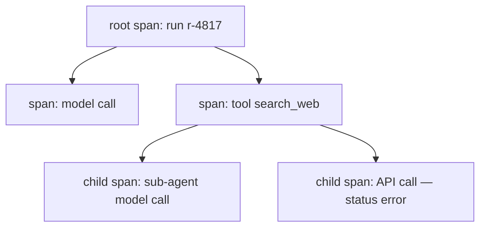

## The span model — tree, attributes, status

**In brief.** "A span per step" is only the first half of the model. The half that decides what you can
actually debug is structural: spans nest into a tree by parent-span id, trace context has to be carried
across process boundaries to keep one run in one trace, and each span carries the raw attributes and
status you will later slice and read for near-misses.

**Key terms.**

- **Trace as a tree, not a flat list** — the OTel model: a trace is a tree of spans linked by parent-span id. A flat list is fine while steps are sequential, but the moment a step spawns nested work — a tool that calls a sub-agent that calls the model — only the parent-child links say which span caused which. Flattening the nested step into one span, or splitting it into separate unlinked traces, throws that causality away.
- **Parent-span id** — the field that does the linking, threaded through every hop. It is the same mechanism `Dapper`, Zipkin and Jaeger used to follow one request as it fans out across services; an agent's tool calls are that same fan-out, and the tree is how the whole causal chain stays in one view.
- **Trace-context propagation** — passing the `trace_id` and parent-span id to the callee across a process, service, or sub-agent boundary. Without that hand-off the callee opens a fresh, unlinked trace and one logical run shows up as two disconnected traces. Nothing about a bigger budget or a faster model stitches them back together — only the propagated context does.
- **Span attributes** — the raw inputs recorded per span (model, tokens, tool, latency), not only the derived number. Cost is a function of the model and the token counts, and it is precisely because each span carries its model and tool that you can group cost by tool and by model instead of staring at one total. A span collapsed to a single dollar figure has thrown the inputs — and the slice — away.
- **Span status** — whether the step errored. A step that timed out and then recovered still leaves a plausible final answer, but it cost a retry: extra latency and extra tokens, the same compounding that makes cost bite at volume. It is also the leading indicator of the failure that will not recover once real volume finds the one-in-a-thousand case. The status attribute is what surfaces the near-miss a clean final output hides.

**Why it matters.** Nesting, propagation, and raw attributes are what let you attribute a slow, expensive,
or failing nested step back to the step that invoked it — and they are exactly what a "one flat span per
run, cost only" design silently gives up.
