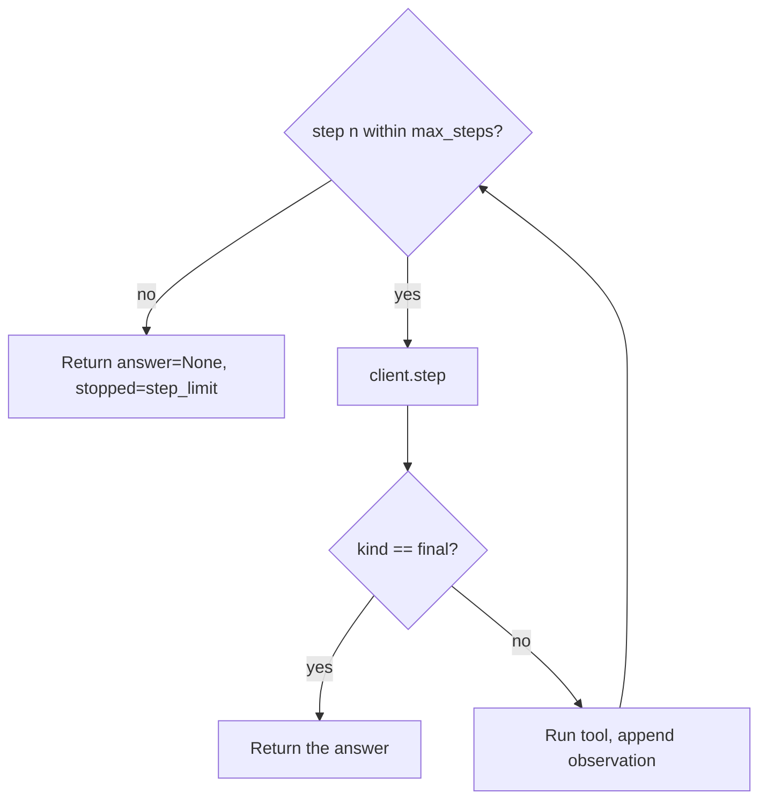

# Single-agent workflows — guardrails on the loop

## Cap the loop

A loop that runs until the agent decides it is done is only safe if "done" is guaranteed to arrive. It
is not. A model can keep emitting `action` steps forever — chasing a goal it can't reach, or bouncing
between two tools. The first guardrail is a hard **max-steps cap**: the loop may run at most *N*
iterations, no matter what the agent wants.



```python
for n in range(1, max_steps + 1):
    step = client.step(messages)
    if step.kind == "final":
        return {"answer": step.answer, "steps": n}
    obs = tools[step.tool](step.tool_input)
    messages.append({"role": "tool", "content": obs})
return {"answer": None, "steps": max_steps, "stopped": "step_limit"}   # can't-finish path
```

The cap turns an unbounded hang into a **bounded, observable failure**. But hitting the cap is an
expected outcome, not a crash — so the loop needs a **can't-finish path**. Instead of raising or, worse,
relabeling the last observation as "the answer," it returns a structured result: `answer=None` with a
reason like `"step_limit"`. The caller can then see the agent gave up cleanly and decide what to do,
rather than being handed a fabricated answer.

Without both pieces a single agent goes rogue in one of two ways: it spins forever (no cap), or it
invents an answer to escape the loop (no honest can't-finish path). Together they bound the runtime
*and* keep the result truthful.

## Log every step

The loop is otherwise a black box: you see the final answer but not how the agent got there. The third
guardrail is **per-step logging** — record the thought, the action and its input, and the observation
at every iteration.

```python
log = []
for n in range(1, max_steps + 1):
    step = client.step(messages)
    log.append({"step": n, "kind": step.kind, "tool": step.tool, "obs": obs_preview})
```

When an agent produces a wrong answer, the log is how you find *where* it went wrong: which observation
it misread, which tool it should not have called, the step where it started drifting. An unlogged loop
gives you nothing to debug. Logging every step is the operational record that makes a single-agent
system auditable — the difference between "the agent was wrong" and "the agent was wrong *here, because
of this observation*."

See [agent-guardrails-budgets](../../agent-guardrails-budgets/) for step and token budgets, and
[harness-engineering](../../harness-engineering/) for where the log lives in the harness.
