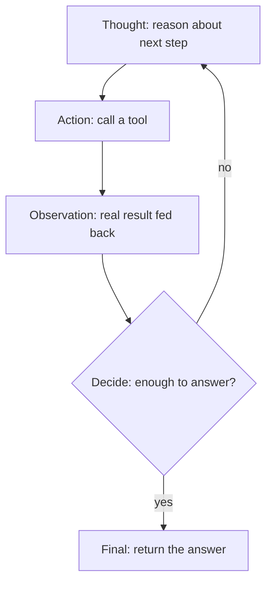

# Single-agent workflows — the ReAct loop

## Reason act observe decide

A single agent does not answer in one shot. It runs a **loop**: it reasons about the task, acts by
calling a tool, observes what came back, and decides whether it is done. That cycle —
**Reason → Act → Observe → Decide** — is the ReAct pattern, and it is what turns a model into an agent
that works toward a goal instead of guessing in one turn.



Each iteration starts with a **Thought**: the agent reasons, in writing, about what to do next. The
thought is not decoration — it is what selects the next **Action** (a tool) and its input. Reasoning and
acting are interleaved: the agent thinks, then acts on that thinking, so the tool it picks is justified
by the reasoning right before it.

```python
step = client.step(messages)          # the agent reasons and emits a step
if step.kind == "action":
    observation = tools[step.tool](step.tool_input)   # Act, then Observe
    messages.append({"role": "tool", "content": observation})
```

After acting, the agent **observes** the real result and feeds it back, then **decides**: with the
observation in hand, does it now have enough to answer, or does it reason and act again? That decision
is the branch that either ends the loop with a final answer or runs one more iteration.

## The loop runs until done

The loop keeps going because each step the agent emits is one of two **kinds**: an `action` (call a
tool, observe, continue) or a `final` (return the answer and stop). The kind of the step is the whole
signal — an action means *loop again*, a final means *we are done*.

```python
def run_react(client, task, tools, max_steps=10):
    messages = [{"role": "user", "content": task}]
    for n in range(1, max_steps + 1):
        step = client.step(messages)
        if step.kind == "final":
            return {"answer": step.answer, "steps": n}     # done
        obs = tools[step.tool](step.tool_input)
        messages.append({"role": "tool", "content": obs})  # observe, then loop
    return {"answer": None, "steps": max_steps, "stopped": "step_limit"}
```

Notice the loop length is not fixed: an easy task finishes in two steps, a harder one in eight. The
agent decides when it is done by emitting a `final` — the loop is adaptive, driven by the step kind
rather than a counter. (The `max_steps` cap in the last line is the guardrail the next section is
about; here it is only the backstop.)

See [harness-engineering](../../harness-engineering/) for the harness that owns this loop, and
[agent-guardrails-budgets](../../agent-guardrails-budgets/) for the budgets that bound it.
