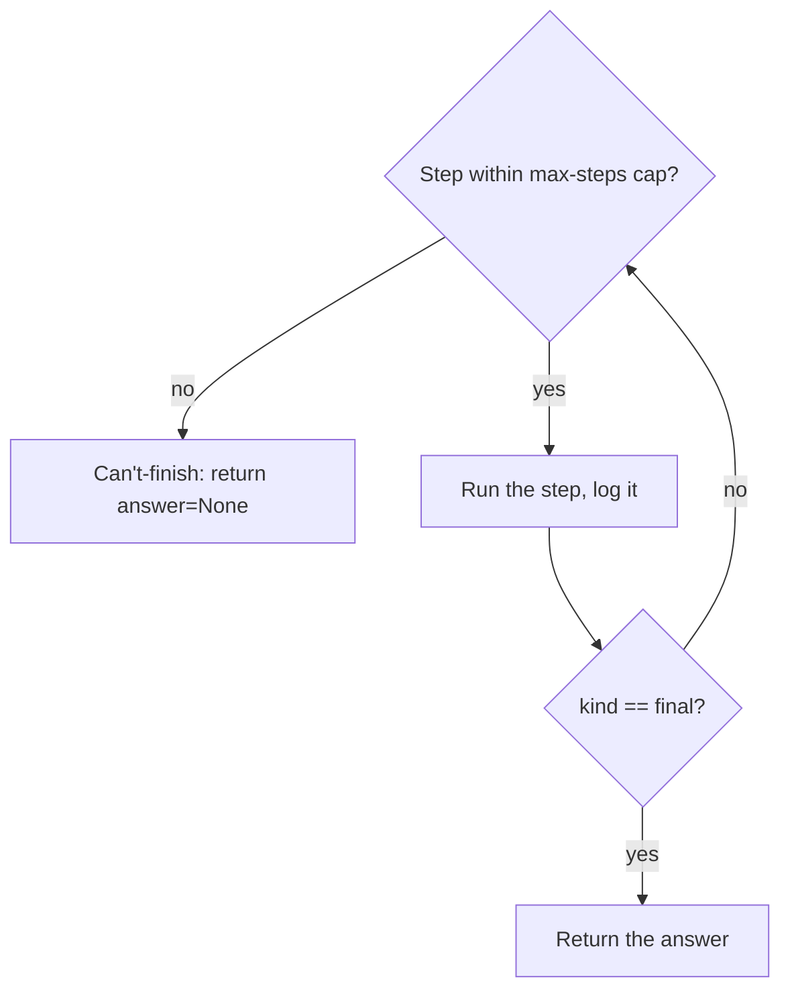

# Single-Agent Workflows (ReAct) — guardrails roadmap

## Roadmap: guardrails on the loop

**What this section covers.** A loop that runs until the agent decides it is done is only safe if
"done" is guaranteed to arrive. This section adds the guardrails that bound and expose the loop — a
hard step cap, an honest give-up path, and per-step logging — and closes on why long-horizon
reliability is still an open frontier.

**The ideas you'll meet:**

- **Max-steps cap** — a hard limit on iterations so an agent that can't reach "done" cannot spin forever.
- **Can't-finish path** — hitting the cap returns a structured `answer=None` instead of a crash or a fabricated answer.
- **Bounded, observable failure** — the cap turns an unbounded hang into a clean, inspectable stop.
- **Per-step logging** — recording the thought, action, and observation each iteration so a wrong answer is debuggable.
- **Long-horizon reliability** — the frontier: over dozens of steps, errors compound silently and robust recovery is unsolved.

**Why it matters.** Guardrails are what make a single agent safe to run unattended: they bound its
runtime *and* keep its result truthful, and they mark exactly where the solved ground ends and the
research edge begins.
