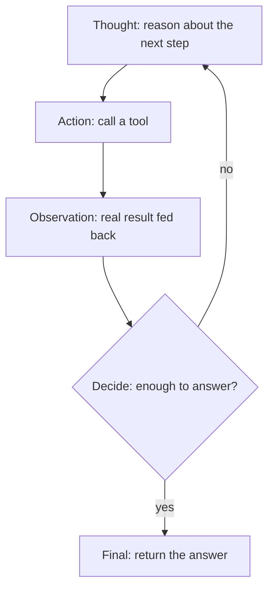

# Single-Agent Workflows (ReAct) — ReAct-loop roadmap

## Roadmap: the ReAct loop

**What this section covers.** How a model that answers in one shot becomes an agent that works toward
a goal — the **Reason → Act → Observe → Decide** cycle, the line-structured step format that makes each
turn machine-routable, and the step *kind* that keeps the loop running until the job is done.

**The ideas you'll meet:**

- **ReAct** — interleaving reasoning and acting so each improves the other; the pattern (Yao 2022) this whole topic is built on.
- **Reason → Act → Observe → Decide** — the four-step cycle one iteration of the loop runs.
- **Thought / Action / Observation** — the labeled lines of the step format the harness parses deterministically.
- **Step kind (`action` vs `final`)** — the control signal read off each step: `action` means loop again, `final` means stop.
- **Observation grounding** — feeding the *real* tool result back so the next Thought reasons over what happened, not what the model imagined.
- **Adaptive loop** — the run has no fixed length; it repeats until the agent emits a `final`.

**Why it matters.** This loop is the foundation everything else rests on — the guardrails and output
validation in the later sections are all constraints bolted onto this one cycle of thinking, acting,
and observing.
