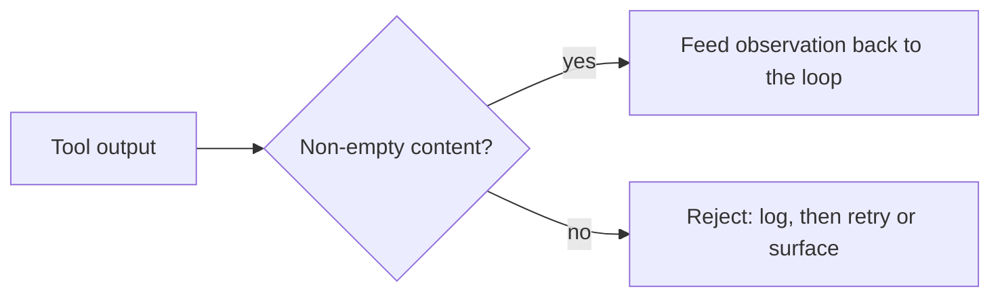

# Single-Agent Workflows (ReAct) — output-validation roadmap

## Roadmap: validating tool outputs

**What this section covers.** The Observe step feeds a tool's output back into the loop — but that
output is not always usable. This section adds the fourth guardrail: a boundary check that rejects
empty or malformed observations *before* they reach the agent's next Thought.

**The ideas you'll meet:**

- **Observation** — the tool output the Observe step feeds back into the loop as the next turn's input.
- **Boundary check** — is the output real content (a non-empty string or structure) rather than `None`, empty, or malformed?
- **Reject before feeding back** — a failed check never re-enters the loop as if it were a result; it is logged and retried or surfaced.
- **Untrusted tool result** — the agent is an untrusted consumer of tool output, just as a tool is an untrusted consumer of the agent's arguments.

**Why it matters.** One bad observation fed back derails every step after it, so validating outputs at
the seam is what keeps a single agent from reasoning confidently over garbage.
