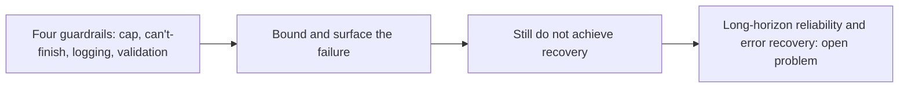

## Bounding a loop is not recovering it

**In brief.** The guardrails on a single-agent loop are complementary layers, not substitutes: each
covers a different failure, and together they bound the runtime and keep the result truthful. What
none of them does is make a drifting agent get back on track — that is where the solved ground ends
and the research edge begins.

**The four layers.**

- **Max-steps cap** — a hard limit on iterations, so an agent that keeps emitting `action` steps (or bounces between two tools) cannot spin forever. It solves exactly one failure mode: unbounded runtime.
- **Can't-finish path** — hitting the cap returns a structured result (`answer=None` with a reason like `step_limit`) instead of crashing or relabeling the last observation as the answer. Without it, an agent invents an answer to escape the loop.
- **Per-step logging** — the thought, the action and its input, and the observation at every iteration. It is what turns "the agent was wrong" into "the agent was wrong here, because of this observation." An unlogged loop gives you nothing to debug.
- **Output validation** — a boundary check that rejects an empty or malformed observation before it re-enters the loop, so the agent never reasons over garbage.

**Why any one of them alone is not enough.**

- Each covers a different failure: unbounded runtime, a fabricated escape answer, undetectable drift, and reasoning over garbage. The cap is the clearest case — it bounds runtime and says nothing about correctness, so an agent can still burn its whole budget reasoning confidently over a broken observation and hand back a plausible wrong answer.
- A bigger model, a larger context window, or a shorter loop substitutes for none of them, and letting the agent pick its own step limit hands the bound back to the thing being bounded.

**The long-horizon frontier.**

- **Errors compound silently** — over dozens of steps, an early wrong observation or misread tool result does not throw. It just tilts every subsequent Thought, until the agent has drifted far from the task and no single step looks broken. Keeping a long single-agent run correct is an open problem, not a solved one.
- **Bounding and surfacing is not recovering** — the guardrails contain the damage (the cap stops the run, the log shows where it drifted, validation keeps garbage out), but they do not make the agent detect mid-run that it has gone off the rails and re-ground, back up, or abandon a bad line of reasoning. That automated error recovery is materially harder than bounding the loop, and it is the active research edge.
- **What does not close the gap** — a bigger `max_steps` only gives a drifting agent more room to drift, and a faster model just runs the same flawed loop quicker.

**Why it matters.** Naming the guardrails as four independent layers is what lets you say which one a
failure needs, and knowing that they bound and surface a bad run without repairing it is what keeps
you from claiming long-horizon reliability is a checkbox the existing guardrails already tick.
