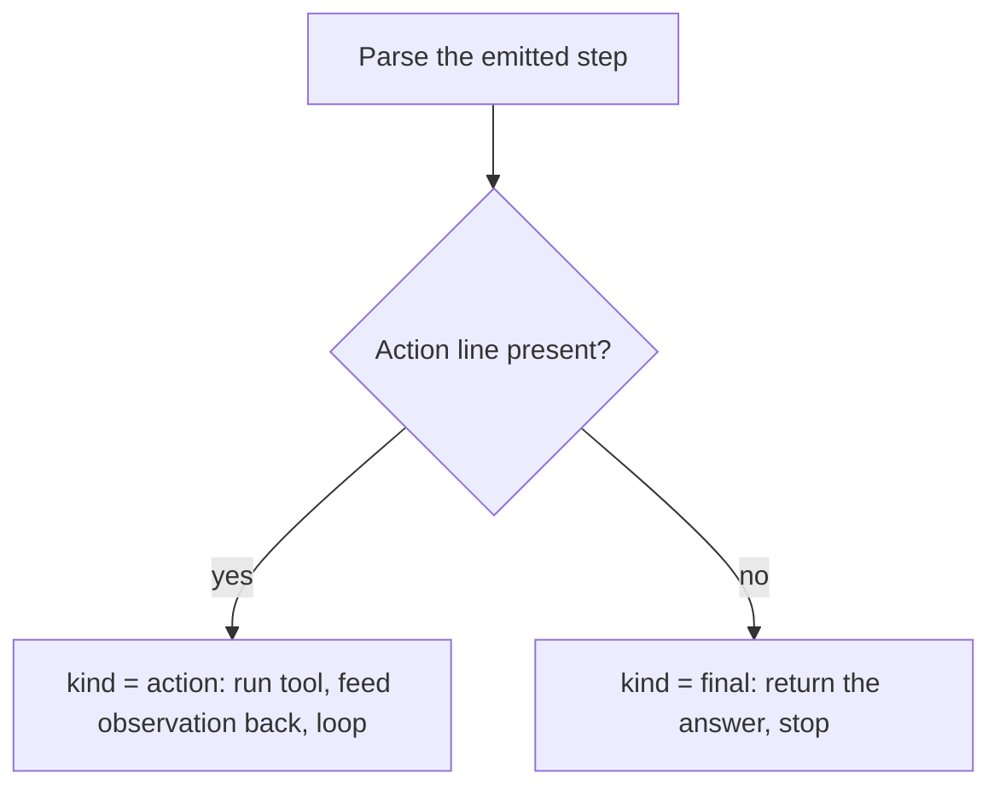

## Anatomy of a ReAct step

**In brief.** One turn of the loop is a single step whose shape does two jobs at once: it lets the
harness route deterministically between running a tool and stopping, and it keeps the next Thought
anchored to what the tool really returned.

**The parts of a step.**

- **Thought** — the written reasoning, on its own labeled line. It is not decoration: it is what selects the next Action and its input.
- **Action and Action Input** — the tool name and its argument, each on its own labeled line, so the harness can pull each field out deterministically rather than guessing at prose.
- **Observation** — the one part the model does not write. The harness runs the tool and appends the real result on the `Observation:` line before the next Thought.
- **The Action-line discriminator** — a thought-only step, with no Action line, is the model saying "I can answer now." Presence or absence of that line is exactly what the parser turns into the step **kind**: `action` when present, `final` when absent. Parsing must handle both shapes; a final step is not a special keyword, it is a missing line.

**Grounding when the tool fails.**

- **Feed back the genuine result** — including an error string or an empty answer. The observation is whatever actually came back, not a cleaned-up version of it.
- **What that buys** — with the real failure in hand, the agent can retry, pick a different action, or give up cleanly, because its next decision is anchored to the true tool outcome rather than to a plan made before the tool ran.
- **The failure it prevents** — a hallucinated observation. If the loop let the model assume its action succeeded and narrate a made-up result, that one imagined observation would poison every step after it, and the agent would drift with no signal that anything went wrong.

**Why reasoning plus acting beats either half.**

- **Reasoning alone (chain-of-thought)** — lets the model plan, but the plan is untethered: nothing checks it against the world, so the model drifts and hallucinates facts.
- **Acting alone (tool calls with no visible reasoning)** — gathers real information, but no explicit plan ties the calls together, so the model flails.
- **Interleaved (ReAct)** — the reasoning trace decides and revises the next action, and the observations feed real information back into the reasoning. Each half corrects the other; that mutual correction is the synergy in the pattern's name.

**Why it matters.** The step format is what makes the loop machine-routable and honest at the same
time: the Action line is the whole continue-versus-stop signal, and the real `Observation:` line is
why interleaving reasoning with acting beats doing either one alone.
