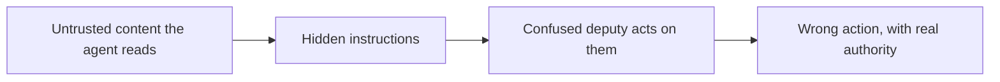

# Security & guardrails — prompt injection roadmap

## Roadmap: prompt injection

**What this section covers.** The single biggest threat to an agentic system: the moment your agent reads
text it did not write, that text can carry instructions it will obey. This section names the attack, why
it turns your agent into a *confused deputy*, and where it sits on the field's shared checklist.

**The ideas you'll meet:**

- **Prompt injection** — untrusted content smuggles in commands the model follows as if you had issued them; the #1 risk on the OWASP LLM Top 10.
- **Direct vs. indirect injection** — direct is typed straight into the prompt; indirect is planted in content the agent later *fetches*, and is the dangerous one.
- **Confused deputy** — the agent has real authority; the attacker, who has none, tricks it into using that authority on their behalf.
- **Blast radius** — an injected *agent* takes a wrong action, not just says a wrong thing; the damage is every tool it can reach.
- **OWASP LLM Top 10** — the field's shared checklist of LLM exploits, with prompt injection at the top.
- **No general solution** — a capable model is built to follow instructions wherever they appear, so injection is mitigated in layers, never fully patched.

**Why it matters.** Every later guardrail — separation, sandboxing, redaction, egress control — exists to
contain this one threat, so you have to understand the attack before the defenses make sense.
