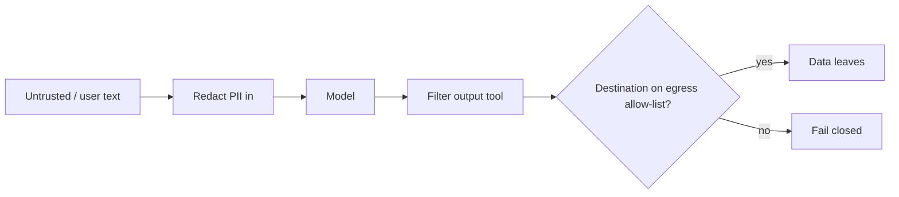

# Security & guardrails — redaction and egress roadmap

## Roadmap: redaction and egress control

**What this section covers.** The guardrails that sit on the *data flowing through* the agent rather than
the code it runs: redact sensitive data going in, filter the actions coming out, and control where data is
allowed to go so a hijacked turn still cannot phone home.

**The ideas you'll meet:**

- **Redact PII** — scrub emails, phone numbers, and secret-looking tokens before untrusted text enters the context, so there is less to leak.
- **Output filtering** — inspect the action the model proposes and block disallowed tools before the harness executes them.
- **Data leakage / exfiltration** — a data-flow failure where sensitive data reaches a destination it should never reach; the *destination* is the attack.
- **Egress allow-list** — a default-deny list of permitted destinations; an unlisted host fails closed, so an injected attacker URL is refused.
- **Defense in depth** — redaction and egress control are the outermost layers that stop whatever data survives every earlier guardrail.

**Why it matters.** Even a successful injection is stopped at the wire: a confused deputy that cannot reach
an attacker's URL cannot exfiltrate to it, however convincingly the injected content asked.
