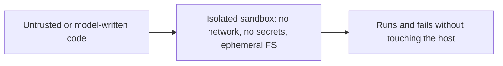

# Security & guardrails — sandboxing roadmap

## Roadmap: sandboxing untrusted code

**What this section covers.** The next class of risk after untrusted *text* is untrusted *execution*: an
agent that writes and runs code is running input you do not control. This section covers isolating that
code so it can fail without touching anything real, and the posture of building security in from day one.

**The ideas you'll meet:**

- **Sandbox** — a confined environment where hostile code runs with no access to your real filesystem, network, secrets, or host.
- **Least authority** — give the agent the minimum tools and permissions it needs; a confused deputy cannot pull a lever it was never handed.
- **Build security in** — separation, sandboxing, and the rest are cheap and robust when designed in from day one, brittle when bolted on after an incident.
- **Assume every input is hostile** — untrusted content, tool results, and model output are all suspect by default and constrained at the boundary.

**Why it matters.** Isolating untrusted execution is both a technical control and a compliance posture —
the boundary an audit points at when you claim one tenant's code cannot reach another's data.
