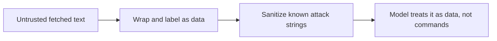

# Security & guardrails — separation roadmap

## Roadmap: separating and sanitizing

**What this section covers.** The first and most important defense against prompt injection: keep the
model's trusted instructions in a channel untrusted content cannot impersonate, and scrub the known attack
strings out of that content before the model ever reads it.

**The ideas you'll meet:**

- **Separate instructions from content** — put system instructions in the system prompt; mark fetched text as data to analyze, not commands to obey.
- **The system prompt channel** — the channel the model is built to trust; never concatenate untrusted text straight into it.
- **Sanitize** — a best-effort filter that scrubs known injection phrasings ("ignore previous instructions", "system prompt:") and replaces them with a neutral marker.
- **Defense in depth** — separation and sanitizing are layers, not guarantees; each raises the attacker's cost, none is trusted alone.

**Why it matters.** Injection has no single fix, so the layered habit of separating channels and
sanitizing content is the foundation every other guardrail builds on.
