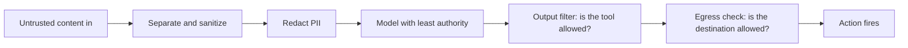

## Designing the layers

**In brief.** Injection has no single fix, so every control in this topic is one layer of a defense in
depth. Each layer is picked for a specific property — it grants less authority, it contains instead of
predicting, it fails closed, and it is assumed bypassable on its own. Knowing which property each layer
buys is what lets you defend a design instead of just listing controls.

**The layer principles.**

- **Least authority shrinks the blast radius, it does not stop the attack** — give the agent the minimum tools and permissions the task needs. An injection that convinces the model to call `send_email` or a payment tool still fails if the agent was never handed that tool. A confused deputy cannot pull a lever it was never given, so the high-authority tools stay gated behind explicit allow-lists.
- **Containment beats prediction** — a sandbox does not depend on anyone judging the code correct first. Model output is suspect by default, so "ask the model whether this code is safe" is not a control: the reviewing model can itself be injected, or simply wrong. The isolation boundary confines even code that was wrongly approved — no mounted credentials, no outbound network, an ephemeral filesystem, bounded CPU, memory, and time.
- **Default-deny: allow-list, never block-list** — an allow-list names what is permitted and refuses everything else, so a newly added or cleverly renamed dangerous tool, and a freshly injected attacker host, are blocked without anyone enumerating every bad case in advance. A block-list only stops what you remembered to forbid, so anything it forgot to name passes. The output filter and the egress allow-list share this discipline: unlisted means fail closed, not fail open.
- **Every layer is best-effort** — sanitizing misses a payload phrased a way your patterns do not cover, redaction misses a novel secret-token format, a naive filter misses a cleverly named tool, and a sandbox may have an edge. A layer leaking is not a reason to delete it — it still shrinks the blast radius for everything it does catch — it is the reason no layer is trusted alone.
- **Defense in depth is the point** — because each control is individually bypassable, an attacker has to defeat separate, sanitize, sandbox, redact, filter, and egress all at once. That is what makes the system survive the failure of any single layer, and why the answer to a leaky control is another layer rather than a search for one perfect one.
- **Which layer answers which risk** — prompt injection is the OWASP LLM Top 10 entry at #1, and the rest of that list is what the guardrails address. Redaction brackets the input side and addresses sensitive-information disclosure: what never enters the context cannot leak. Output filtering brackets the action side and addresses insecure output handling and excessive agency: the proposed tool call is checked against an allow-list before the harness runs it.

**Why it matters.** Naming the property each layer buys — less authority, containment, fail-closed,
best-effort — is what lets you say why a control is there and what it does not do, and it is why a filter
that leaks is still worth keeping as one layer among several.
