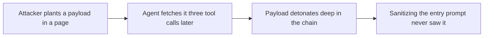

## The frontier: indirect injection

**In brief.** The solid ground is separate, sanitize, sandbox, redact, and filter. The frontier is the
honest admission that they are mitigations, not a cure: the dangerous injections arrive indirectly, they
chain through tools, and the attack surface compounds with scale. An expert names the open case rather
than claiming it is closed.

**The open cases.**

- **Indirect injection is the practical, dangerous form** — direct injection is typed straight into the prompt by whoever is talking to the agent. Indirect injection is planted in content the agent fetches: a web page, a document, a database row, a code comment, another agent's output. What makes it worse is that the attacker never has to interact with your agent at all — they leave a trap where the agent will step on it, and it fires whenever the agent reads it.
- **Second-order injection chains through tools** — content the agent retrieves triggers a tool call whose result carries the next payload, so a trap can detonate several tool calls after the agent first touched it. Sanitizing the direct prompt does nothing for a payload the agent walks into three tool calls later.
- **No general solution, and scale does not help** — there is no known way to let a capable model both follow instructions and never follow instructions hidden in data, because those are the same capability. Every defense is probabilistic and bypassable, and a larger model does not close the gap — a more capable model follows a cleverer injection just as faithfully. The research edge is raising the attacker's cost, not shutting the door.
- **Unsolved at scale** — across many tools, many turns, many concurrent agents, and content flowing between them, the surface grows rather than shrinks: excessive agency, cross-tenant leakage, and injections that only fire deep in a tool chain. More agents do not cross-check each other into safety, and more compute does not make it a throughput problem. A single sanitized entry prompt is no longer the whole story.
- **The honest posture** — this is an active frontier, not a checklist you can complete. The credible read defends in depth, names indirect and tool-chained injection as the open case, and does not claim a fix.

**Why it matters.** It is the same trust gap the whole topic rests on — content the agent reads is
untrusted — at the scale where one sanitized prompt no longer covers it, and claiming injection is solved
is the fastest way to sound naive about agent security.
