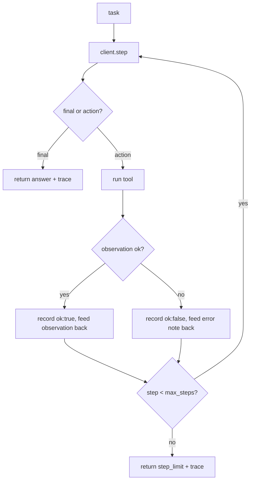

# Ship in public — build the capstone agent

## Build the capstone agent

This is the integrative exercise: assemble the three earlier topics into one real agent. From
[agentic-tool-calling](../agentic-tool-calling/) you take **tool calling** — the model requests a tool,
the harness runs it, the observation is fed back. From [agentic-react-loop](../agentic-react-loop/) you
take the **bounded reason–act loop** — keep stepping until the model returns a final answer or you hit a
hard step cap, so a misbehaving model can't spin forever. From [agentic-evaluation](../agentic-evaluation/)
you take the **eval suite** — a set of cases and a judge that turn "it worked once" into a measured pass
rate. The capstone is where these stop being three separate lessons and become one program.

Concretely, `run_capstone(client, task, tools, max_steps)` drives the loop. On each step the client
returns either an **action** (a tool name plus input) or a **final** answer. On an action, the harness
runs `tools[tool](tool_input)`, then **validates the observation** — a real agent does not trust that a
tool returned something useful. An empty or `None` observation is recorded as `ok: False` and fed back as
an error note so the model can recover; a good observation is recorded as `ok: True`. Every step lands in
a **trace**, so the run is auditable after the fact.

```python
def run_capstone(client, task, tools, max_steps=8):
    messages = [{"role": "user", "content": task}]
    trace = []
    for step in range(max_steps):
        out = client.step(messages)
        if out.kind == "final":
            return {"answer": out.answer, "steps": step + 1, "trace": trace}
        observation = tools[out.tool](out.tool_input)
        ok = observation not in (None, "", [], {})
        trace.append({"tool": out.tool, "ok": ok})
        note = observation if ok else f"error: {out.tool} returned nothing"
        messages.append({"role": "user", "content": str(note)})
    return {"answer": None, "steps": max_steps, "stopped": "step_limit", "trace": trace}
```



The three things that make this a *capstone* rather than a toy: the loop is **bounded** (it always
terminates), every observation is **validated** before it is trusted, and every step is **traced** so you
can explain what happened. Those are exactly the behaviors an interviewer probes for — and exactly what a
README, an eval suite, and a demo are meant to prove about the agent you ship.
