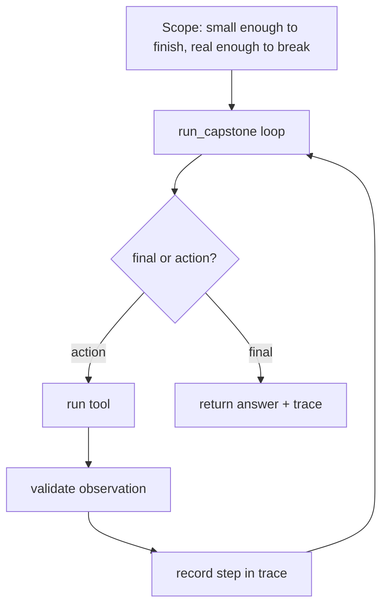

# Ship in public (Capstone) — scope-and-build roadmap

## Roadmap: scope and build the capstone

**What this section covers.** How to size the agent so it actually ships, and the three behaviors —
bounded, validated, traced — that turn a scoped task into a real agent rather than a toy.

**The ideas you'll meet:**

- **Scope** — pick one useful task the agent does end to end: small enough to finish, real enough to break.
- **Bounded loop** — keep stepping until a final answer or a hard `max_steps` cap that guarantees termination.
- **Observation validation** — check each tool result; an empty or `None` observation is recorded `ok: False` so the model can recover.
- **Trace** — a record of every step (which tool ran, whether it was `ok`) that makes the run auditable.
- **run_capstone** — the driver that assembles tool calling, the bounded loop, and validation into one program.

**Why it matters.** Bounded, validated, and traced are exactly the behaviors an interviewer probes for, and
they are what your README, eval suite, and demo are meant to prove about the agent you ship.
