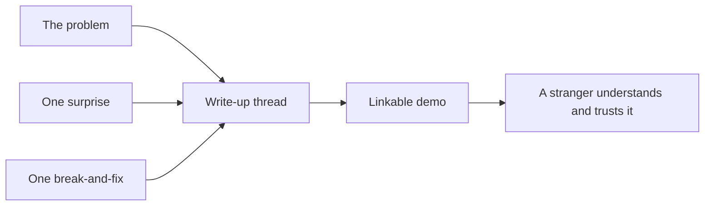

# Ship in public (Capstone) — communicate roadmap

## Roadmap: communicate the work

**What this section covers.** The half of the capstone that travels: how to write up the agent as a short
narrative a reviewer will actually read, paired with a demo they can watch.

**The ideas you'll meet:**

- **The problem** — state the task in one sentence and the shape of the agent in a few more.
- **One surprise** — a decision that did not go as expected; credible because tutorials never have them.
- **One break-and-fix** — a concrete failure and exactly how you fixed it, because debugging is the job.
- **Thread** — a short public write-up (build-in-public thread, blog post, or README section) that is durable and linkable.
- **Demo** — a ninety-second Loom-style clip of the agent running, linked from the thread.

**Why it matters.** A reviewer rarely runs your code first — they read how you talk about it, so a clear
write-up plus a linkable demo is what lets a stranger understand what you built and trust that you do too.
