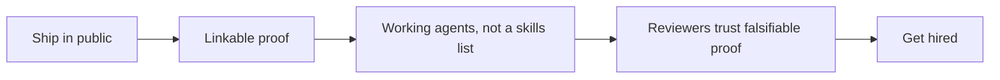

# Ship in public (Capstone) — get-hired roadmap

## Roadmap: ship in public to get hired

**What this section covers.** How shipped work argues for you in the market — why proof beats pedigree, and
what the agentic-engineer job market rewards as its bar keeps rising.

**The ideas you'll meet:**

- **Proof over pedigree** — the market rewards one real, linkable agent over a resume of the right words.
- **Ship in public** — make the work linkable: a repo, a README, a demo, and evals anyone can rerun.
- **Working agents, not a skills list** — a shipped agent is falsifiable proof; a skills list is only a claim.
- **The role is being defined in public** — "AI engineer" means different things at different companies, so shown work travels better than a title.
- **A rising bar** — as more people ship, the differentiator moves to measured, defensible agents.
- **Eval-harness** — a tiny reusable harness that runs an agent over cases and reports a pass rate, baking evidence into every capstone.

**Why it matters.** The agentic-engineer market is new and fast-moving, but shipped, measured, well-communicated
agents are the durable signal — so shipping in public is the highest-leverage career move at this frontier.
