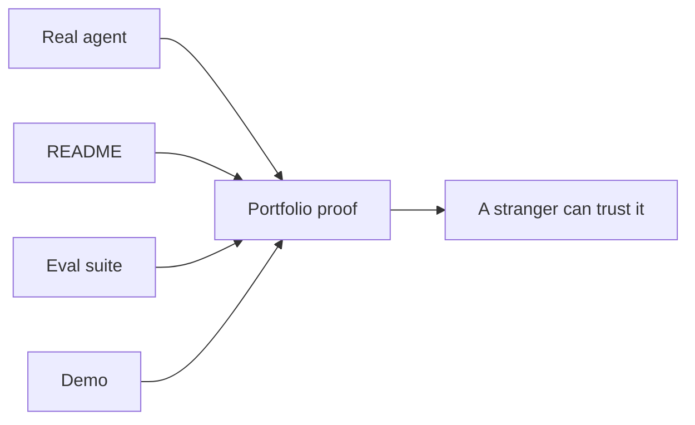

# Ship in public (Capstone) — what-to-ship roadmap

## Roadmap: what to ship

**What this section covers.** Why a shipped agent beats a resume line, and the four artifacts that turn
"I can build agents" into proof a stranger can open, read, and verify.

**The ideas you'll meet:**

- **Proof beats a resume** — evidence you built and can reason about a working agent outweighs the same buzzwords everyone lists.
- **Real agent** — a bounded loop that calls tools and produces a result, not a chatbot wrapper or a tutorial clone.
- **README** — the document that explains what the agent does, how it is built, and one architecture decision and why.
- **Eval suite** — cases plus a judge that let you say "it passes N of M" instead of "it seemed to work."
- **Demo** — a short recording or runnable script that shows the agent working on a real input in ninety seconds.
- **Portfolio** — the combined artifact set: something a stranger can open, read, and run.
- **Architecture decision record** — one clear "we chose X over Y because Z" that shows judgment under tradeoffs.
- **Self-designed over tutorial clone** — a project you scoped has decisions in it; a copy has none, which is why it reads as proof.

**Why it matters.** Everything later in this topic — scoping, building, communicating, getting hired — exists to
produce these artifacts, because they are the falsifiable proof a reviewer trusts over any list of skills.
