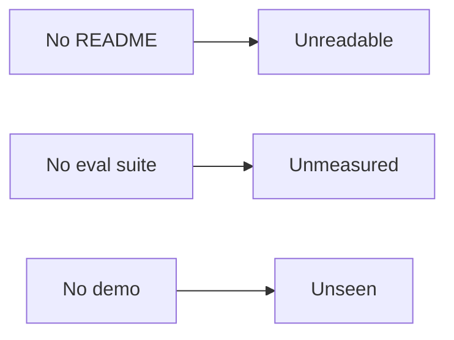

## What the capstone ships, and what each piece proves

**In brief.** The capstone is not new material — it is the integration test for the track: tool calling, a
bounded reason–act loop, and an eval suite assembled into one agent you can defend. It ships with three
artifacts, and each carries a different kind of proof, so a missing artifact leaves a specific, nameable
hole.

**The pieces.**

- **The capstone as assembly** — tool calling (the model requests a tool, the harness runs it, the observation is fed back), a bounded reason–act loop (keep stepping until a final answer or a hard `max_steps` cap), and an eval suite (cases plus a judge plus a pass rate) stop being three separate lessons and become one program. The point of the whole track is that integration and the defensible decisions inside it — not a new technique and not a tutorial reproduction.
- **Trace** — every step records which tool ran and whether it was `ok`. That makes the run **auditable** after the fact: you can explain exactly what happened and which tool returned nothing. It is how you find a break, and it is what the demo and the write-up ultimately draw on.
- **README** — carries the **architecture**: what the agent does, how it is built, and one defended `chose X over Y because Z`. Without it the proof is **unreadable** — a reviewer can run the code but cannot tell what the task is, how it is built, or why it is built that way.
- **Eval suite** — carries the **evidence**: cases plus a judge plus a reported pass rate turn "it seemed to work" into "it passes N of M." Without it the agent is **unmeasured**, so a demo that got lucky once is indistinguishable from an agent you verified. It reads as senior precisely because most portfolios skip it — it signals you treat an agent as a system to verify, not a demo to hope over, and that you know where it fails.
- **Demo** — carries **"it actually runs"**: a ninety-second Loom-style recording or a runnable script. Whichever form, what makes it a demo is that it shows the agent working on a real input rather than describing what it would do. Without it the agent is **unseen** — the reviewer reads the architecture and the numbers but never watches it work.

**Why it matters.** Bounded, validated, and traced are exactly what the README, the eval suite, and the
demo are meant to prove about the agent you ship — and naming the hole each missing artifact leaves
(unreadable, unmeasured, unseen) lets you audit a portfolio, your own included, in seconds.
