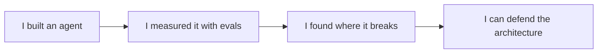

## The career frontier: a rising bar

**In brief.** The stable ground of this track is technical; the frontier here is a **career** frontier. The
agentic-engineer job market is new, the title is unstable, and the norms for what a strong agent portfolio
looks like are still being figured out in public — so what differentiates candidates keeps moving up the
stack.

**What moves, and what stays.**

- **The role is being defined in public** — "AI engineer" and "agent engineer" mean different things at different companies: sometimes prompt-and-glue work, sometimes deep systems work on reliability and evals. The honest read is that the title is unstable, so a portfolio that shows what you actually do travels better than a title that hides it.
- **The bar rises as more people ship** — early on, any shipped agent stood out. As shipping becomes common the differentiator moves up the stack: not "I built an agent" but "I built an agent, measured it with evals, found where it breaks, and can defend the architecture." Candidates who ship measured, defensible agents pull ahead of candidates who ship demos.
- **Portfolio norms churn** — live-demo expectations, standardized agent evals for hiring, and agent-portfolio conventions are unsettled and move fast, in public. Freezing on today's template is wrong, and so is chasing every flashier format at the cost of the evals and README that carry the proof.
- **The invariant is verifiable proof** — keep shipping self-designed agents whose README defends a decision, whose evals measure them, and whose write-up shows a break-and-fix. The surface conventions move; proof that argues for you unattended is what keeps predicting who gets hired.
- **How to track it** — read real job postings, hiring threads, and portfolios that land well rather than hype; they show where the differentiating bar actually sits. Of each one, ask what its README defends, what its evals measure, and what break-and-fix its write-up shows.
- **What compounds** — models and frameworks churn. Judgment and communication stay valuable: scoping a real task, making an architecture decision under tradeoffs, evaluating the result honestly, and explaining all three — the muscles the capstone trains.

**Why it matters.** An expert here does not claim the job market is solved or predictable — they claim that
shipped, measured, well-communicated agents are the durable signal while everything around them changes,
and they keep shipping to stay on the right side of a rising bar.
