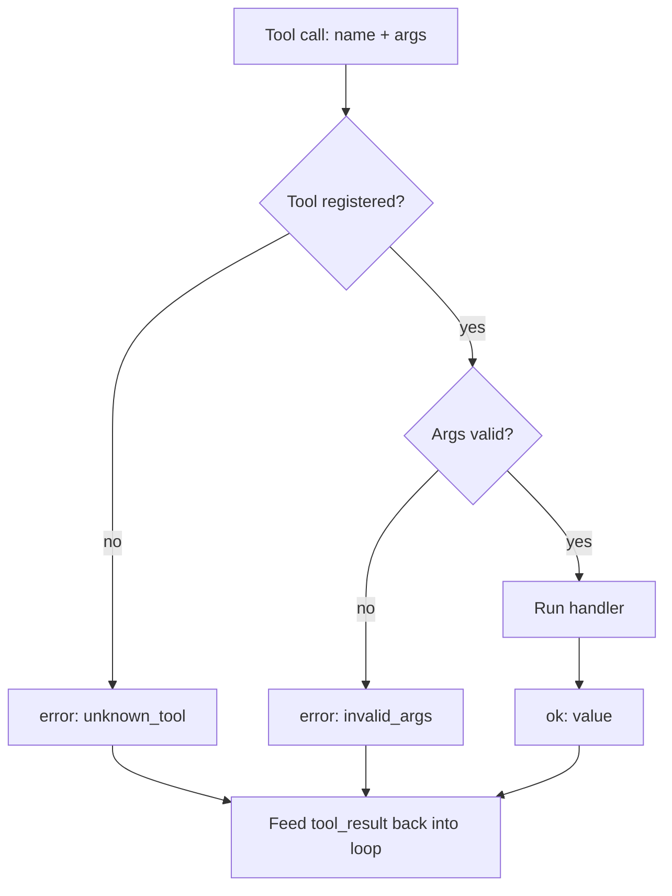

# Tool calling & structured outputs — recovering from bad tool calls

## The model will call tools wrong

However good the model, it will eventually call a tool wrong. It will name a tool that isn't registered
(a **hallucinated call**), or call a real tool with a required field missing or the wrong type. These
are not rare edge cases — they are *expected input* to your harness, and how you handle them decides
whether the agent is robust or brittle.

The rule is: **validate first, and reject bad calls with a structured error — do not crash.** An
unknown tool name should not raise an exception that ends the session; it should return something like
`{"ok": False, "error": "unknown_tool"}`. Invalid arguments should fail schema validation *before* the
handler runs, so a mutating tool never executes on garbage input.

```python
def safe_call(registry, name, args):
    tool = registry.get(name)
    if tool is None:
        return {"ok": False, "error": "unknown_tool"}   # reject, don't raise
    validate = tool["validate"]
    if validate is not None and not validate(args):
        return {"ok": False, "error": "invalid_args"}    # handler NOT run
    return {"ok": True, "value": tool["handler"](args)}
```

The antipatterns are all forms of executing unvalidated input: guessing the "closest" real tool for a
hallucinated name, silently defaulting a missing field, or blindly coercing a string to a number. Each
turns a recoverable mistake into a wrong side effect or a crash.

## Recover instead of crashing

Rejecting a bad call is only half the job. The structured error has to go **back into the loop** as a
`tool_result` so the model can read it and try again. An error the model never sees is useless; an
error fed back becomes a self-correcting step.

```python
result = safe_call(registry, resp.tool_name, resp.tool_input)
messages.append(tool_result_message(resp, result))   # feed the error back too
# next turn: the model reads "invalid_args" and retries with a corrected call
```

Make the error **model-facing** — specific enough to act on ("field `amount` is required and must be an
integer"), not an opaque stack trace. That is the whole recovery loop: validate, reject with a
structured error, feed it back, let the model correct itself. Crashing the session or silently dropping
the call gives the model nothing to recover from; a readable error keeps the agent alive and improving.


