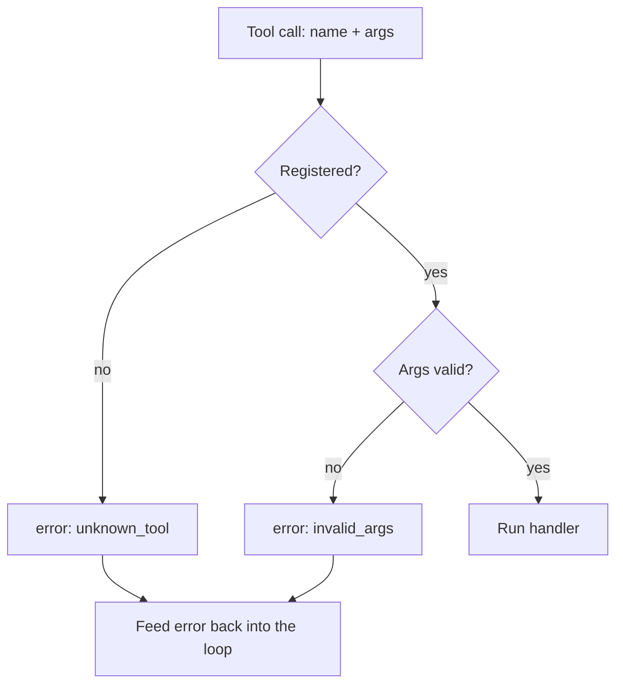

# Tool calling & structured outputs — recovery roadmap

## Roadmap: recovering from bad tool calls

**What this section covers.** What to do when the model calls a tool wrong — naming a tool that doesn't
exist, or supplying bad arguments. You'll see why that is *expected input* rather than a rare edge case,
and the discipline that keeps the agent alive: validate first, reject with a structured error, and feed
that error back so the model corrects itself.

**The ideas you'll meet:**

- **Hallucinated call** — the model names a tool that isn't registered; reject it, don't guess the closest match.
- **Invalid arguments** — a required field missing or the wrong type; fail schema validation *before* the handler runs.
- **Reject, don't crash** — return a structured `{ok: false, error}` instead of raising and ending the session.
- **Model-facing error** — an error specific enough to act on, fed back as a `tool_result` so the model self-corrects.

**Why it matters.** Whether an agent is robust or brittle is decided here. A readable error fed back
into the loop becomes a self-correcting step; a crash or a silently dropped call gives the model nothing
to recover from.
