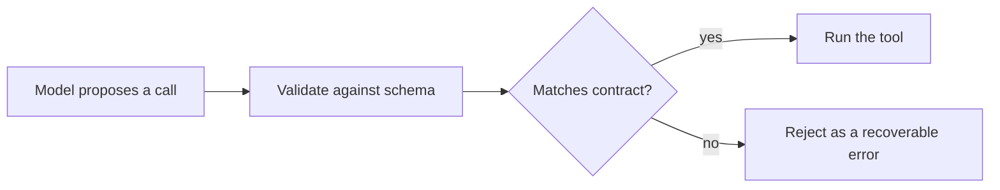

# Tool calling & structured outputs — schemas roadmap

## Roadmap: typed tool schemas

**What this section covers.** How a tool's *schema* turns the model's proposed call into something your
harness can check before it runs — the anatomy of a schema (name, description, typed parameters,
`required` fields) and why treating the model as an untrusted caller of your API is what stops a
malformed call from becoming a bad side effect.

**The ideas you'll meet:**

- **`input_schema`** — the JSON-Schema contract naming each argument, its type, and whether it is required.
- **`required`** — the list separating mandatory arguments from optional ones; the first thing to check on a malformed call.
- **Validate and coerce** — checking the model's arguments against the schema *before* anything runs.
- **Untrusted caller** — treating every tool call like a request to a web API: nothing executes until it passes the gate.

**Why it matters.** The schema is the gate between "the model asked" and "the tool ran." A typed
contract turns a malformed call into a *rejectable error the model can be told about* — the difference
between a recoverable step and an undefined-behavior bug.
