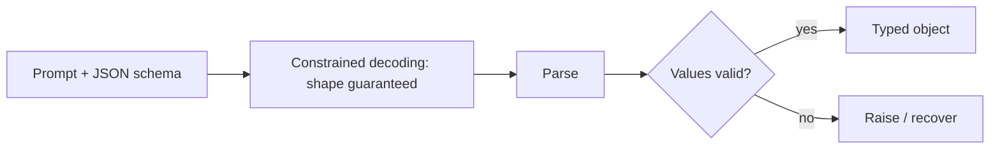

# Tool calling & structured outputs — structured-outputs roadmap

## Roadmap: structured outputs and validation

**What this section covers.** How to trust the *data* a model returns. A model asked for structured
output returns a string that might parse yet still be wrong, so you validate it against a schema at the
boundary — and, better, use a structured-outputs mode that constrains decoding so the shape is
guaranteed before you even check the values.

**The ideas you'll meet:**

- **Structured output** — asking for data in a declared shape, then treating the raw string as untrusted until checked.
- **Validation** — parsing into a schema (e.g. Pydantic) so a bad field fails loudly at the boundary, not silently downstream.
- **Constrained decoding** — a structured-outputs mode that guarantees the JSON *shape*, so you validate *values* rather than hope.

**Why it matters.** Without validation a wrong field flows silently downstream and corrupts something
far from where the mistake happened. Catching it at the boundary turns a hidden bug into an immediate,
local, recoverable error.
