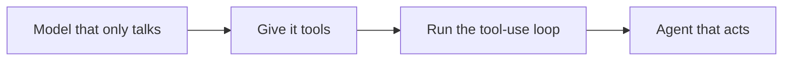

# Tool calling & structured outputs — tool-loop roadmap

## Roadmap: tools and the tool-use loop

**What this section covers.** How a model that can only produce text becomes an agent that takes
action — what a *tool* is, and how the *tool-use loop* lets the model request a tool, read the real
result, and decide what to do next.

**The ideas you'll meet:**

- **Tool** — a function plus a description the model can request; the seam between *describing* an action and *taking* it.
- **The tool-use loop** — call the model, run the tool it asks for, feed the result back, and repeat until it finishes.
- **`stop_reason`** — the signal the loop branches on: `tool_use` means run a tool and continue; `end_turn` means return the answer.
- **tool_result** — how a tool's output is fed back to the model (tied to its call by `tool_use_id`) so the next turn is grounded.

**Why it matters.** This loop is the foundation everything else rests on — schemas, structured outputs,
and recovery all assume a clean boundary between the model *asking* for a tool and the harness
*running* it.
