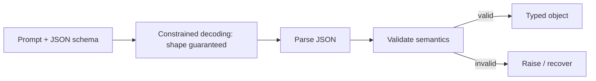

# Tool calling & structured outputs — structured outputs

## Validate everything the model returns

When you ask a model for structured data — a report, an extraction, a set of arguments — it returns a
string. That string might parse as JSON and still be wrong: a required key missing, a number where you
expected a string, a `confidence` of `1.7`. **Never trust the raw string.** Parse it, then validate the
result against a schema before any field flows into the rest of the program.

In Python the standard tool for this is **Pydantic**: you declare the expected shape as a model, and
parsing the JSON into it validates every field's type and constraints at the boundary.

```python
from pydantic import BaseModel, field_validator

class Report(BaseModel):
    topic: str
    summary: str
    key_findings: list[str]
    confidence: float

    @field_validator("confidence")
    @classmethod
    def _range(cls, v: float) -> float:
        if not 0.0 <= v <= 1.0:
            raise ValueError("confidence must be in [0, 1]")
        return v

report = Report.model_validate_json(raw)   # bad output raises here, loudly
```

The point is *failing loudly at the boundary*. Without validation, a wrong `confidence` or a missing
`summary` flows silently downstream and corrupts something far from where the mistake happened.
Validating up front turns that into an immediate, localized error you can catch and recover from.

## Forcing valid output

Validation catches bad output *after* the fact. Structured-outputs mode prevents a whole class of it
*up front*. A **JSON-schema / `response_format` structured-outputs mode** constrains the decoder so that
at each step it can only emit tokens consistent with the schema. The result is **guaranteed** to parse
and match the shape — you are no longer prompting for JSON and hoping the model complied.

```python
resp = client.create(
    messages=messages,
    response_format={"type": "json_schema", "json_schema": Report.model_json_schema()},
)
report = Report.model_validate_json(resp.text)   # still validate values
```

Use both together. Structured-outputs mode guarantees the *shape* is valid; a validator like Pydantic
still enforces the *semantics* the schema can't fully express (a confidence in range, a non-empty
findings list). Constrained decoding gets you a parseable object; validation gets you a *correct* one.


