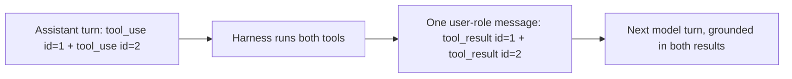

## Wiring the loop — results, ids, and bounds

**In brief.** Branching on `stop_reason` is only the decision the loop makes; this is the plumbing
around it — the exact message shape that carries a tool's output back, the id that binds each result to
the call that asked for it, and the cap that keeps the whole thing bounded.

**The wiring.**

- **The result message** — running the tool is only half a turn. The model cannot see the result unless
  you put it back into the conversation, and there is a specific shape for that: a **user-role message**
  whose content is a **tool_result block**. Not a system prompt, and not an assistant message. That
  feedback step is what makes the loop an agent rather than a one-shot function call.
- **`tool_use_id`** — each `tool_result` echoes the id of the `tool_use` request that produced it. That
  id — not the position of the result in a list, and not the `tool_name` — is what links output back to
  the exact call.
- **Parallel tool calls** — a single assistant turn may contain several `tool_use` blocks. The harness
  runs each one and returns one `tool_result` per call, each carrying its own `tool_use_id`, in the
  single user-role message that follows. Get the pairing wrong and every individual result is still
  correct while the model attributes outputs to the wrong calls and reasons over corrupted
  associations — which is exactly the failure the id exists to prevent.
- **The step cap** — always cap the loop at a fixed number of steps. A model that keeps requesting tools,
  or ping-pongs between two of them, would otherwise run forever. A hard cap turns that into a bounded,
  observable failure you can log and handle instead of silent infinite work.

**Why it matters.** These are the details that decide whether a loop that looks right on a whiteboard
actually grounds the next turn in what happened: the wrong message role means the model never sees the
result, a mismatched id means it sees the wrong one, and no cap means it may never stop.
