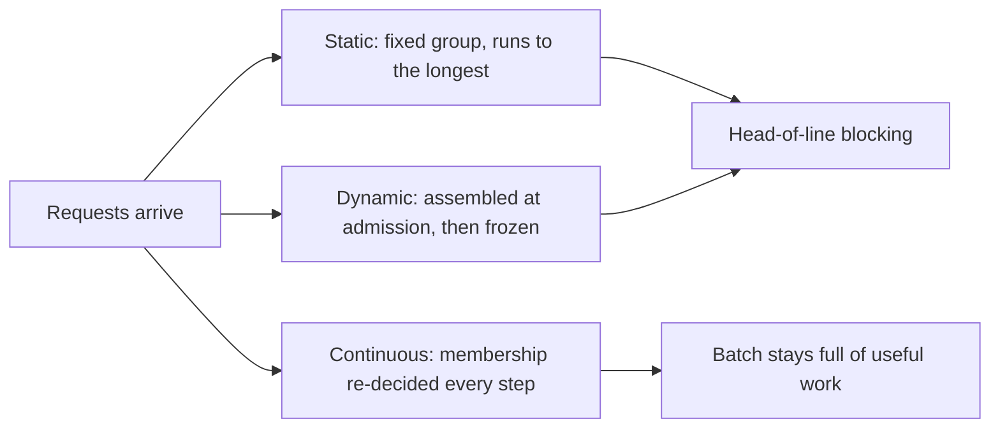

# Batching, paged attention & throughput — batching roadmap

## Roadmap: forming the batch

**What this section covers.** How a serving engine groups many requests onto one GPU, and why the
*way* you form the batch — static, dynamic, or continuous — is the single biggest lever on how much
useful work the GPU does under real, variable-length traffic.

**The ideas you'll meet:**

- **Static batching** — a fixed group launched together that runs until its single longest request finishes.
- **Dynamic batching** — a batch assembled on the fly at admission time, but frozen once it starts.
- **Continuous (in-flight) batching** — membership revisited every decoding step, so finished requests leave and queued ones join immediately.
- **Head-of-line blocking** — a long request at the front pinning slots that shorter, finished requests can no longer use.
- **Makespan** — the step at which the last request in a workload finishes; the number a scheduler shrinks.

**Why it matters.** Getting from static to continuous batching is the biggest throughput win in modern
LLM serving — it is what keeps the GPU busy with useful work instead of idling behind one slow request.
