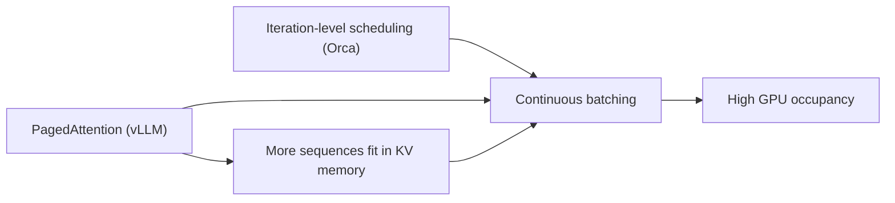

# Batching, paged attention & throughput — scheduling & paging roadmap

## Roadmap: iteration-level scheduling and paged attention

**What this section covers.** The two enablers that make continuous batching actually work:
*iteration-level scheduling*, which re-decides the running set every decode step, and *paged
attention*, which lays out the KV cache flexibly enough for that decision to pack the GPU. It closes
with how a staff engineer reviews such a design and names its canon.

**The ideas you'll meet:**

- **Iteration-level scheduling** — deciding which requests run once per decode iteration instead of once per request; the mechanism under continuous batching (Orca, 2022).
- **KV cache** — the per-sequence memory that grows one block per generated token.
- **PagedAttention** — storing the KV cache in fixed-size, non-contiguous blocks, borrowing OS virtual-memory paging (vLLM, 2023).
- **Block table** — the per-sequence map from logical KV blocks to physical GPU blocks.
- **Fragmentation & over-reservation** — the wasted GPU memory that contiguous max-length KV buffers cause, and that paging eliminates.
- **The design levers** — batch formation, scheduling granularity, KV layout, batch size, and SLO awareness, each with a cost you can name in a review.

**Why it matters.** Iteration-level scheduling decides *who* runs each step; paged attention makes the
*memory* flexible enough for that decision to pack the GPU. Together they are the core of every modern
serving engine.
