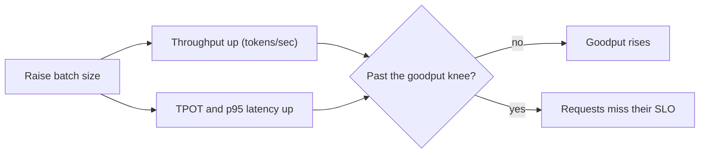

# Batching, paged attention & throughput — throughput roadmap

## Roadmap: throughput, latency and goodput

**What this section covers.** The objective a serving engine is actually tuned against: bigger batches
lift aggregate *throughput* but raise per-request *latency*, so the real target is *goodput* — work
completed within its latency SLO. It closes with the frontier of goodput-aware scheduling and the
signals you watch when the server is live.

**The ideas you'll meet:**

- **Throughput** — aggregate tokens per second across all requests; rises with batch size.
- **TTFT & TPOT** — time-to-first-token and time-per-output-token, the two per-request latency metrics users feel.
- **Tail / p95 latency** — the slow end of the latency distribution that climbs as the batch grows.
- **SLO** — an explicit latency target (e.g. "p95 TPOT under 50 ms") a request must meet to count.
- **Goodput** — the rate of requests completed *while still meeting their SLO*; the real objective under a latency target.
- **Goodput knee** — the batch size past which extra throughput comes only from SLO-violating requests.
- **Operational signals** — occupancy, queue depth, and preemption rate, the live numbers you alert and capacity-plan on.

**Why it matters.** Raw throughput is a trap under a latency SLO — push batch size only to the goodput
knee, because beyond it the throughput chart keeps climbing while the work users actually accept falls.
