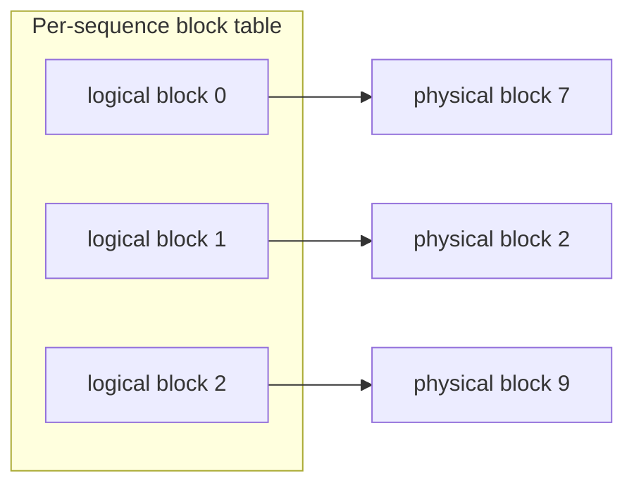

# Iteration-level scheduling & paged attention

## Iteration-level scheduling

Continuous batching is only possible because of a scheduling change introduced by **Orca (Yu et al.,
2022)**: **iteration-level scheduling**. A traditional server schedules **once per request** — it
decides what runs when a request is admitted, then leaves the batch alone until it finishes. Orca
instead makes a scheduling decision **once per decoding iteration**: before each forward pass it chooses
which requests participate in the next step.

Because the running set is re-evaluated every forward pass, completed requests exit and queued requests
enter at **token granularity** rather than request granularity. That is the mechanism underneath
continuous batching, and it is what dissolves head-of-line blocking: a long request can no longer pin a
slot past the point where a neighbor has finished.

## Paged attention as the enabler

There is a memory obstacle to keeping a batch of mixed, still-growing sequences full. Each sequence
needs a **KV cache** that grows one block per generated token. The naive approach reserves one large
**contiguous** buffer per sequence, sized for the worst-case maximum length. That wastes enormous
amounts of GPU memory to **fragmentation** and **over-reservation**, and reshuffling contiguous buffers
as sequences come and go is painful.

**PagedAttention (vLLM, Kwon et al., 2023)** borrows the idea of **virtual-memory paging**. It stores
each sequence's KV cache in **fixed-size, non-contiguous blocks**, addressed through a per-sequence
**block table** — exactly like an OS mapping virtual pages to physical frames. Blocks are allocated on
demand as a sequence grows and freed when it finishes.

This is why paged attention is called the **enabler** for high-throughput continuous batching:

- It nearly eliminates KV fragmentation and max-length over-reservation, so far more concurrent
  sequences fit in memory and the effective batch size grows.
- Sequences of differing, growing lengths can be admitted and evicted every iteration **without** a
  giant contiguous re-layout — the block table just maps to whatever free blocks exist.

Iteration-level scheduling decides *who* runs each step; paged attention makes the *memory* flexible
enough for that decision to actually pack the GPU. Together they are the core of a modern serving
engine.
