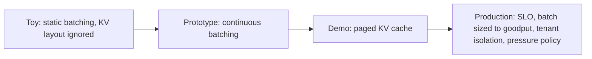

## Reviewing a batching and serving design

**In brief.** Every serving decision here is really a decision about how much useful work you keep on
the GPU each step, and at what per-request latency and memory cost. Reviewing a design — in a doc or
an interview — means walking the levers and naming, for each, what it buys, what it costs, and the
regime where it wins.

**The levers.**

- **Batch formation** — static, dynamic, or continuous. Static freezes a hand-picked group until its
  single longest request finishes; dynamic assembles a batch at admission time but still runs it to
  completion; continuous (Orca-style) re-decides membership **every decoding iteration**, so the
  moment an active request emits its end-of-sequence token its slot is freed and a waiting request is
  admitted on the very next step. This is the single biggest structural lever against head-of-line
  blocking, and the reason the batch stays full of useful work rather than of finished slots.
- **Head-of-line blocking** — what frozen membership costs you. A long-output request holds its slot
  for the batch's whole lifetime, so short requests that already finished sit idle in completed slots
  **and** the queued requests behind them cannot start until a slot frees. With output lengths
  spanning something like 20 to 2000 tokens this is the first thing to flag in a static or dynamic
  design. Note what does **not** fix it: raising the batch size, or padding every output to the
  maximum length to make the batch rectangular — neither touches the frozen-membership problem.
- **Scheduling granularity** — once per request versus once per iteration. Iteration-level scheduling
  is the mechanism underneath continuous batching: the running set is re-evaluated before every
  forward pass, so no long request can pin a slot past the point a neighbor finished.
- **KV memory layout** — one large contiguous per-sequence buffer sized for `max_seq_len` versus
  paged, fixed-size, non-contiguous blocks addressed through a per-sequence block table. Continuous
  batching mixes sequences of varying, still-growing lengths; block-level allocation on demand is
  what lets them be admitted and evicted each iteration **without** a giant contiguous re-layout or
  worst-case reservation. That flexibility is why paged attention is the enabler for high occupancy,
  not merely a memory optimization.
- **Operating point (batch size)** — how large you let the running batch get. Bigger batches amortize
  weight loads and lift aggregate throughput, but each request shares the GPU with more peers, so
  TPOT and p95 climb. A knob to tune, not a fixed choice.
- **SLO awareness** — whether the scheduler optimizes raw throughput or **goodput** (work completed
  within its latency SLO). A goodput-aware scheduler treats the SLO as an admission and batch-sizing
  signal rather than counting every finished request as a win.

**The review checklist.**

- **How is the batch formed?** Static or dynamic under variable output lengths is an immediate
  head-of-line-blocking flag; continuous batching should be the default.
- **How is the KV cache laid out?** Contiguous max-length reservation per admitted sequence fills the
  pool with mostly-empty worst-case reservations, so concurrency stays low and the GPU OOMs well
  below its expected batch size — prototype-grade even with continuous batching switched on. The fix
  is paged fixed-size blocks allocated on demand; lowering `max_seq_len` just truncates long requests,
  and reverting to dynamic batching abandons the throughput win.
- **Is there an SLO, and does the scheduler know about it?** A **batch-blind SLO** — raising batch
  size until aggregate tokens/sec stops increasing while the product carries a p95 TPOT target — is
  the classic bad PR. Past the goodput knee the extra tokens/sec are delivered entirely by requests
  that miss their latency target, so throughput climbs while goodput falls.
- **What sets the operating batch size?** A fixed cap with no goodput signal leaves latency
  protection to luck; the design should name the goodput knee it targets and tune to the point where
  **goodput**, not throughput, stops improving.
- **What happens under pressure?** A real design names its admission and queueing policy, caps a
  single request's footprint, and states what the user experiences when the batch is full — queue,
  reject, or degrade — never "it just works."

**Why it matters.** These checks place any serving design on the toy → prototype → demo → production
ladder in minutes, and they name the answers that read as shallow: "just crank the batch size,"
reserving contiguous max-length KV "to be safe," and reporting aggregate tokens per second under a
latency SLO.
